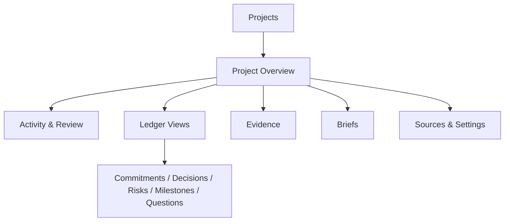
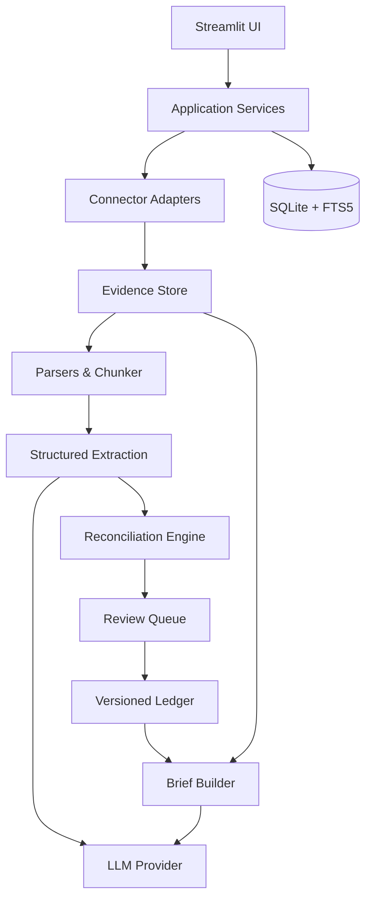
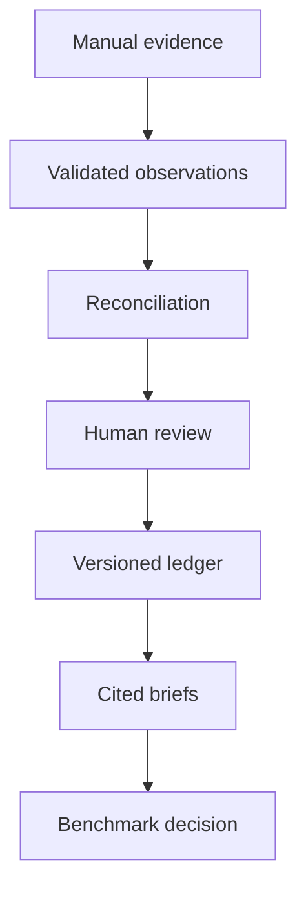

# Project Context — Product and Implementation Plan v1

**Planning date:** August 22, 2026  
**Prototype window:** Four focused weeks, 35–50 hours  
**Builder:** Solo, part-time  
**Status:** Implementation-ready plan; no production code included

---

## 1. Executive summary

### Product definition

Project Context is a single-user, project-centered application that turns explicitly bounded emails, calendar events, meeting transcripts, documents, and manual notes into a persistent, reviewable project ledger. The ledger records decisions, commitments, milestones, risks, blockers, open questions, stakeholders, and material updates. Each item retains evidence links, confidence, review state, and history. The application produces two views of that state: a Current Project Brief and a Meeting Preparation Brief.

It is not a chatbot over a folder. Its value is that the project state survives across meetings and sources, changes only through traceable proposals, and can answer not just “what was said?” but “what is true now, what changed, and why do we believe it?”

### Initial customer

The first customer is a client-facing professional managing roughly 5–20 concurrent projects: implementation consultant, professional-services lead, fractional executive, customer-success leader, or project/program manager. The prototype is for the founder’s personal or synthetic data. The first pilots should remain manually supported and single-user.

### Problem being solved

Project truth is fragmented across messages, meeting records, calendar context, and living documents. Reconstructing it before a meeting is slow, repeated summaries lose prior decisions and superseded dates, and unsupported model claims are difficult to challenge. Existing systems usually store artifacts or tasks; they do not maintain a compact, evidence-linked account of what the project currently requires attention.

### Core value proposition

> In under five minutes, produce a current, evidence-linked account of a project and a meeting-preparation brief without rereading its recent history.

### Central hypothesis

> A simple, evidence-backed project ledger that persists across meetings, emails, and documents will produce more accurate and useful project intelligence than repeatedly summarizing recent source material.

### Scope verdict

The core product is useful within four weeks if the target is a **local, single-user functional prototype**, not a public SaaS. The full requested connector list is near the upper edge of 50 hours and must be implemented shallowly: manual OAuth setup, one account, manual sync, constrained project rules, no webhooks, and limited parser fidelity.

| Commitment | Prototype decision |
|---|---|
| Manual text/files | Required and built first |
| Persistent ledger and review | Required; this is the product hypothesis |
| One Drive folder/project | Required, but broad folder discovery creates a restricted-scope commercialization issue |
| Gmail label/query | Thin read-only connector; first connector cut if OAuth blocks progress |
| Calendar matching | Metadata/context only; not authoritative project state by itself |
| Fathom | API-key polling only; no OAuth or webhook in prototype |
| Zoom | Reuse Zoom-to-Drive output; no native integration |
| Embeddings/graph/agents | Excluded until a measured retrieval failure justifies them |

Why this version is appropriately scoped: it tests the differentiating behavior—persistent, evidence-backed state and reconciliation—using a UI and storage stack the builder already knows. It does not spend the first month proving connector plumbing or memory architecture.

---

## 2. Product principles

1. **Ledger before language.** Generated prose is a view over stored state, never the system of record.
2. **Evidence or explicit inference.** Every factual brief claim links to one or more source spans. Derived claims are labeled `Inference` and cite the facts used.
3. **Sources are immutable.** Source revisions create new content versions; imported evidence is never silently overwritten.
4. **Projects are hard boundaries.** Retrieval and generation always require one `project_id`. No cross-project search is permitted in MVP request paths.
5. **Proposals are not facts.** LLM output enters as observations/proposed mutations. Deterministic validation and, when needed, user review precede ledger mutation.
6. **User corrections outrank automation.** A correction is retained, attributable, and protected from automatic reversal without new evidence and review.
7. **Uncertainty is visible.** Missing owner/date, weak project assignment, conflicts, and unsupported interpretation are surfaced rather than filled in.
8. **External systems are read-only.** The prototype never sends email, modifies calendars, edits Drive files, or creates external tasks.
9. **Prefer bounded retrieval.** Project boundary, item type, status, date, people, and FTS5 should solve retrieval before embeddings are considered.
10. **Complexity earns admission.** A new architectural component requires a named failure metric, a baseline, and an expected improvement.
11. **Idempotence over cleverness.** Re-running the same sync must not duplicate evidence, observations, or ledger transitions.
12. **Human effort is a product metric.** Review time, edits, and rejections are measured; a “smart” system that creates clerical work has failed.

---

## 3. User and jobs to be done

### Primary persona

**Multi-project client lead**

- Manages 5–20 active client projects.
- Moves between meetings with limited preparation time.
- Receives decisions and commitments across email, calls, and documents.
- Is accountable for identifying risk before it becomes escalation.
- Needs to defend statements with the original evidence.
- Will accept a small review queue but not continuous data hygiene.

Secondary early personas are implementation managers, fractional executives, and project managers with similar information fragmentation. Team collaboration is deliberately excluded; these users are relevant only when operating their own ledger.

### Jobs to be done

| Situation | Job | Success signal |
|---|---|---|
| Before a meeting | Reconstruct what changed and what needs discussion | Useful brief in <5 minutes; evidence accessible in one click |
| After a meeting | Capture decisions, owners, dates, blockers, and questions | >80% of high-confidence proposals accepted with minor/no edits |
| During weekly review | See overdue, blocked, risky, or unanswered items across one project | No known material item absent from the ledger |
| When facts conflict | Determine whether an item changed, completed, was canceled, or is uncertain | Prior state preserved; new state is evidence-backed |
| When challenged | Show why the system made a claim | Source and exact span visible |
| When a model errs | Correct it once and measure recurrence | Correction retained; repeated-correction rate trends downward |

The product does **not** initially serve executives seeking portfolio analytics, teams co-editing plans, or users wanting an autonomous assistant. Those jobs require different permissions, collaboration, and trust controls.

---

## 4. Detailed scope

### Must-have features

#### Foundation

- Create, edit, view, and archive a project with name, objective, description, stage/status, client/organization, and explicit source boundaries.
- Local single-user configuration, SQLite database, filesystem evidence store, migrations, and structured logs.
- Manual text entry and upload of TXT, MD, DOCX, PDF, and VTT.
- Content hashing, source versioning, parser status, and exact evidence spans.

#### Project memory

- Atomic observations for `update`, `decision`, `commitment`, `milestone`, `risk`, `blocker`, `open_question`, and `stakeholder`.
- Ledger items with current state plus append-only versions/transitions.
- Owners, due dates, confidence, review state, evidence links, and user corrections.
- Deterministic reconciliation candidates: create, no-op/duplicate, update, complete, cancel, supersede, conflict.
- Review actions: accept, edit and accept, reject, mark complete, mark superseded, view evidence.

#### Retrieval and output

- Project-scoped filters and FTS5 over evidence, observations, and ledger text.
- Current Project Brief and Meeting Preparation Brief only.
- Claim-level citations or inference labels.

#### Connectors

- One Drive folder per project, selected/configured explicitly; manual `Sync Project` only.
- One Gmail label or constrained query per project.
- Calendar match rules using project text, participant emails, client domain, or explicit include/exclude terms.
- Fathom API-key polling with explicit project assignment rules.
- Compatibility with Zoom documents/transcripts already deposited in Drive.

### Should-have if time permits

- Unassigned intake queue for ambiguous Drive/Fathom evidence.
- Bulk accept of only exact-duplicate/no-conflict, high-confidence proposals.
- Side-by-side evidence highlighting in the review screen.
- Export brief to Markdown.
- Connector health panel and “last successful sync” age.
- Rule preview showing which recent sources a proposed boundary would match.
- One-click copy of brief sections.

### Explicit non-goals

Microsoft 365, Slack, Teams, CRM, native Zoom, collaboration, RBAC, billing, mobile, autonomous writes, external task/calendar changes, transcription, portfolio health scoring, resource/financial planning, embeddings, vector databases, knowledge graphs, generalized belief systems, background consolidation, fine-tuning, model routing, public onboarding, and production event infrastructure.

### Assumptions

- Most project evidence is English text and under roughly 100 source artifacts/project during the prototype.
- A typical sync adds 1–10 artifacts and no more than ~100,000 input tokens.
- Users can define a meaningful folder, label/query, domain, or participant rule.
- PDFs are text-bearing; OCR is not promised. Scanned PDFs show a parser warning and require manual text.
- One person may have multiple email addresses; identity merging is manual in MVP.
- Source systems remain authoritative for raw artifacts; the local copy exists for reproducible extraction and evidence display.
- A project has one current objective and stage but may retain historical versions.
- User-triggered sync latency of 30–120 seconds is acceptable.

### Dependencies

- Python 3.11+, Streamlit, SQLite with FTS5, Pydantic v2, Alembic or a minimal numbered migration runner.
- Parsers: standard library/text, `python-docx`, `pypdf` or `pdfplumber`, and `webvtt-py` (or a small VTT parser).
- Google Cloud project, desktop/web OAuth client, Drive/Gmail/Calendar APIs enabled, and test-user configuration.
- Fathom account/API key.
- One LLM API key and an account with access to the selected model.
- Synthetic/public/authorized benchmark corpus.

### Open decisions and recommended defaults

| Decision | Recommended default | Why / deadline |
|---|---|---|
| Drive permission | Private prototype: `drive.readonly`; commercial design: reassess Picker + `drive.file` | Folder-wide automatic discovery is easiest with read-only broad access, but it is a restricted scope. Decide before Week 3. |
| Google OAuth client type | Desktop client for local prototype | Simplifies localhost callback and token storage. Revisit before hosting. |
| Fathom order | Build after core ledger, before Gmail if real test data is available | Transcript evidence tests the core better than calendar metadata. |
| LLM model | `gpt-5.6-terra`, low reasoning, pinned configuration | Balanced quality/cost and Structured Outputs support. Benchmark before changing. |
| Auto-accept | Disabled except exact deterministic duplicates/no-ops | Trust and evaluation first. |
| PDF OCR | Exclude; warn | OCR threatens schedule and is not central to hypothesis. |
| Evidence retention | Retain until project deletion; allow source-body purge later | Required for traceability in prototype. |

### Requirements that threaten the four-week boundary

1. **Four live connectors.** They are feasible only as manual, single-account polling adapters. Cut Gmail first, then Calendar, rather than weakening ledger/review quality.
2. **One Drive folder plus least-privilege commercial OAuth.** Folder-wide monitoring and narrow per-file grants are in tension. Do not solve Google verification in the prototype.
3. **High-fidelity PDFs.** Tables, scans, and layout-aware citations are a separate parser project. MVP promises extracted text and page references when available, not visual fidelity.
4. **Perfect person resolution.** Manual aliases are enough for three-project evaluation.
5. **Generated claim-level citations.** This is non-negotiable, but it should be built from ledger-to-evidence links, not by asking the model to invent citations in one pass.

---

## 5. End-to-end user journeys

### 5.1 Create a project

1. User chooses **New Project**.
2. Enters name, objective, description, stage, optional client/organization, and status.
3. System validates required fields and creates `project_id`.
4. System offers source setup or **Start with manual evidence**.
5. Project overview shows empty-state guidance and no invented status.

### 5.2 Connect sources

1. User opens **Sources** within the project.
2. Chooses a connector and authenticates/configures it.
3. Defines an explicit boundary: folder ID, Gmail label/query, calendar rules, or Fathom domain/recorded-by/time rule.
4. System runs a dry match preview against recent metadata only.
5. User confirms; boundary and credential reference are stored separately.
6. Ambiguous matches are routed to **Unassigned Evidence**, never silently attached.

### 5.3 First synchronization

1. User clicks **Sync Project**.
2. System creates a sync run and enumerates sources.
3. New/changed artifacts are hashed, versioned, parsed, and chunked deterministically.
4. Project assignment rules run before any LLM call.
5. LLM extracts atomic observations with exact evidence spans.
6. Schema and span validators reject malformed or unsupported outputs.
7. Reconciliation produces proposed ledger mutations.
8. Sync summary shows counts: discovered, unchanged, parsed, failed, proposed, needs assignment.
9. No project state changes until proposals are accepted, except deterministic source metadata.

### 5.4 Review extracted information

1. User opens **Activity since last review**.
2. Proposals are grouped by evidence item, then severity/type.
3. Each card shows proposed action, before/after state, confidence reasons, and highlighted evidence.
4. User accepts, edits and accepts, or rejects.
5. System writes an append-only review record and ledger transition in one transaction.
6. The project overview updates immediately.

### 5.5 Process a new meeting

1. Zoom workflow deposits a transcript/summary in Drive, or Fathom finishes post-call processing.
2. On next manual sync, the connector finds the new artifact using a bounded time overlap and external ID dedupe.
3. Meeting metadata and transcript become immutable evidence.
4. Extraction proposes decisions, commitments, risks, blockers, questions, and stakeholders—not a generic meeting summary.
5. User reviews proposals and then generates a meeting follow-up/current brief if desired.

### 5.6 Handle conflicting information

1. New evidence says an existing date/owner/status changed.
2. Matcher identifies one or more candidate ledger items.
3. Deterministic rules classify the proposal as update, completion, cancellation, supersession, or unresolved conflict.
4. The review card shows old value, new value, both evidence sets, dates, and source types.
5. User chooses the correct transition or rejects the match and creates a new item.
6. Prior ledger version remains queryable and cited as superseded.

### 5.7 Correct an error

1. User opens a ledger item or proposal and chooses **Correct**.
2. Edits type, wording, owner, date, status, or evidence link and supplies an optional reason code.
3. System saves the original, corrected value, actor, timestamp, reason, model/prompt version, and source context.
4. Future automatic changes to a corrected field require review.
5. Evaluation counts materially similar future errors as repeated corrections.

### 5.8 Generate a Current Project Brief

1. User selects **Generate Brief → Current Project**.
2. Deterministic query assembles current ledger items, latest accepted changes, and evidence links.
3. LLM organizes and compresses only the supplied facts.
4. Validator confirms each factual claim maps to ledger/evidence IDs.
5. Unsupported sentences are removed or labeled inference.
6. Brief is stored with input snapshot, model/prompt version, and citations.

### 5.9 Prepare for a meeting

1. User selects a future calendar event or enters meeting purpose/participants manually.
2. System determines the previous relevant meeting from accepted event/source metadata.
3. It retrieves accepted changes since that point, open commitments by participant, decisions required, risks/blockers, and open questions.
4. User may include/exclude items before generation.
5. Generated brief cites every factual item and labels suggested discussion topics as suggestions.

---

## 6. Information architecture and interface

### Navigation model



Global navigation contains **Projects**, **Unassigned Evidence**, and **Settings**. Everything else is scoped to one project and visibly displays the project name. Avoid a global chat box.

### Screen definitions

| Screen | Primary regions | Key actions |
|---|---|---|
| Project list | Active/archived filter, status, last sync, open-review count, next milestone | Create, open, archive |
| Project overview | Objective/stage, “since last review,” next milestone, open commitments, risks/blockers, sync health | Sync, review, generate brief |
| Activity since last review | New evidence, proposed changes, failures, unassigned items | Filter, inspect, review |
| Review queue | Proposal, current match, before/after, confidence factors, evidence span | Accept, edit+accept, reject, complete, supersede |
| Commitments | Owner, description, due date, status, age, evidence | Filter, correct, complete |
| Decisions | Decision, effective date, status, superseded-by, evidence | Correct, supersede |
| Risks & blockers | Type, severity (manual), status, owner, mitigation, evidence | Correct, resolve |
| Milestones | Name, target date, status, date history | Correct, complete |
| Open questions | Question, owner, opened date, status, answer evidence | Answer/resolve, correct |
| Evidence viewer | Metadata, version, parser status, text with span highlight, external link | Assign/reassign, reparse |
| Brief generation | Brief type, meeting/purpose, included facts, generation result | Generate, copy, export |
| Sources | Connector status, boundary, last sync, last error | Configure, dry run, disconnect |

### Project overview priority

1. **Needs attention:** failed/stale sync, unreviewed proposals, ambiguous evidence.
2. **Current state:** stage, next milestone, blockers/risks.
3. **Commitments:** overdue and due soon first.
4. **Recent change:** accepted transitions since last reviewed timestamp.
5. **Evidence freshness:** last successful evidence timestamp, not merely last button click.

### Review card anatomy

| Region | Content |
|---|---|
| Header | Proposed `UPDATE DUE DATE`, item type, confidence band |
| Current | “Data migration complete — due Aug 28 — owner Priya” |
| Proposed | “Due Sep 4” with changed field highlighted |
| Evidence | Exact quote/span, speaker/author, source title, date, external link |
| Why matched | Same project, normalized subject similarity, same owner, explicit “moved to” language |
| Controls | Accept; Edit & accept; Reject; Treat as new item; Mark current item superseded |

### UX rules

- Red means ingestion/review failure, not model “risk prediction.”
- Confidence is shown as High/Medium/Low plus reasons; avoid false precision in the UI.
- A source link and exact span are accessible without leaving the review card.
- Bulk actions never include conflicts, changed owners/dates, cancellations, or low-confidence proposals.
- Empty fields remain “Not stated.” The UI never replaces absence with a guess.
- Archive hides a project from defaults but does not delete evidence.

---

## 7. Functional requirements and acceptance criteria

### Project and source management

**FR-001 — Project lifecycle.** The user can create, edit, view, and archive a project.  
**Acceptance:** Required name/objective validation works; edits create an audit entry; archived projects disappear from the active default and remain retrievable; project IDs never change.

**FR-002 — Explicit source boundaries.** Each connected source stores a human-readable and machine-readable project boundary.  
**Acceptance:** Sync refuses enabled connectors without a boundary; a dry run displays matched metadata; boundary changes are audited.

**FR-003 — Manual assignment.** Ambiguous evidence can be assigned to exactly one project or rejected.  
**Acceptance:** Unassigned evidence is not supplied to extraction; assignment records user/time/rule outcome; reassignment invalidates pending observations from the former project.

**FR-004 — External read-only behavior.** No connector writes to an external service.  
**Acceptance:** OAuth scopes and code paths contain no write operation; integration tests assert only GET/export/download calls.

### Ingestion and evidence

**FR-005 — Manual text ingestion.** User can paste text with title, date, author/source type, and optional URL.  
**Acceptance:** One source and one content version are created; identical resubmission is detected by hash; entered text is viewable verbatim.

**FR-006 — File upload.** TXT, MD, DOCX, PDF, and VTT files are accepted.  
**Acceptance:** MIME/extension and size are validated; parser output and SHA-256 are stored; unsupported/scanned files fail visibly without an LLM call.

**FR-007 — Immutable content versions.** Changed external content creates a new version.  
**Acceptance:** Old bytes/text remain addressable; current version pointer advances transactionally; observations retain their originating version.

**FR-008 — Evidence spans.** Every extracted observation references a valid character or segment span.  
**Acceptance:** Start/end offsets resolve to non-empty source text; quoted text normalized for whitespace matches the span; invalid spans reject the observation.

**FR-009 — Idempotent sync.** Re-running without source changes produces no new content, observations, or proposals.  
**Acceptance:** Golden connector fixture run twice yields identical row counts except for a new sync-run audit row marked `no_change`.

### Extraction and ledger

**FR-010 — Atomic extraction.** The LLM returns one proposition per observation.  
**Acceptance:** Schema disallows multi-item free-form summaries; fixtures containing three commitments produce separately reviewable observations.

**FR-011 — Supported item types.** Extraction supports update, decision, commitment, milestone, risk, blocker, open question, and stakeholder.  
**Acceptance:** Each type validates required/optional fields; unknown types fail closed.

**FR-012 — Proposal isolation.** Model output cannot directly update a ledger item.  
**Acceptance:** The only ledger mutation service requires a reviewed proposal or explicit manual action; tests bypassing it fail.

**FR-013 — Ledger history.** Every accepted state change preserves its predecessor.  
**Acceptance:** Given three date changes, current query returns the latest and history returns all four values with evidence/review IDs.

**FR-014 — Status transitions.** Items support type-appropriate transitions.  
**Acceptance:** Invalid transitions (for example `canceled → open` without reopen review) are rejected; valid completion/cancellation/supersession records timestamps and evidence.

**FR-015 — Confidence.** Confidence is stored with factor-level reasons.  
**Acceptance:** Confidence cannot be model-provided alone; deterministic penalties/bonuses and resulting band are saved and displayed.

**FR-016 — Corrections.** User corrections retain before/after values and provenance.  
**Acceptance:** Correction row links project, item/proposal, model/prompt, evidence, actor, reason, and timestamp; corrected fields are flagged for future review.

### Reconciliation and review

**FR-017 — Candidate matching.** New observations are matched only against same-project, compatible-type items.  
**Acceptance:** Cross-project and incompatible-type fixtures yield no candidates; candidate features and score are inspectable.

**FR-018 — Duplicate handling.** Semantically and evidentially identical observations become no-ops.  
**Acceptance:** Same external source/version/span cannot create a second observation; repeated phrasing from a second source adds evidence to an existing item only after review or high-confidence deterministic rule.

**FR-019 — Conflict handling.** Changed dates, owners, statuses, cancellation, and supersession create explicit review proposals.  
**Acceptance:** Review shows before/after and both evidence sets; no conflict silently overwrites current state.

**FR-020 — Review actions.** User can accept, edit+accept, reject, complete, supersede, and view evidence.  
**Acceptance:** Each action is transactional, audited, reversible only by a new corrective action, and reflected in pending counts.

**FR-021 — Review resumption.** Queue state survives restarts.  
**Acceptance:** Pending/snoozed/reviewed filters reproduce after application restart; cursor/order is deterministic.

### Retrieval and briefs

**FR-022 — Project isolation.** All retrieval requires a project ID.  
**Acceptance:** Repository/service methods reject null project scope; automated leakage test with identical terms in two projects returns only the requested project.

**FR-023 — Full-text retrieval.** User can search project evidence and ledger text.  
**Acceptance:** FTS5 returns matching source/item IDs with snippets; project/status/type/date filters combine correctly.

**FR-024 — Current Project Brief.** The system generates all specified sections from accepted state.  
**Acceptance:** Missing sections say “No accepted items”; factual bullets contain citation IDs resolving to evidence; brief snapshot is stored.

**FR-025 — Meeting Preparation Brief.** The system generates purpose, changes, participant commitments, required decisions, risks, questions, and discussion suggestions.  
**Acceptance:** “Since previous meeting” uses an explicit cutoff; participant matching is visible; suggestions are labeled and do not masquerade as facts.

**FR-026 — Claim validation.** Unsupported generated claims are not displayed as facts.  
**Acceptance:** Every factual sentence/bullet has at least one valid ledger/evidence ID; invalid IDs fail generation; inference statements carry `Inference:`.

### Connectors and operations

**FR-027 — Google Drive sync.** A configured folder yields new/changed supported files.  
**Acceptance:** Recursive listing honors folder boundary; deleted/trashed items are marked unavailable, not erased; Docs export and binary download fixtures parse.

**FR-028 — Gmail sync.** A label/query yields message bodies and metadata.  
**Acceptance:** Matching IDs are fetched, decoded, deduplicated, and assigned only to the configured project; attachments are excluded unless separately uploaded.

**FR-029 — Calendar sync.** Rules identify relevant events.  
**Acceptance:** Match reason is stored; canceled/deleted events update evidence availability; event metadata alone cannot create a decision/commitment without explicit supporting text.

**FR-030 — Fathom sync.** API-key polling imports authorized meeting metadata/transcripts.  
**Acceptance:** Cursor pagination, overlap window, external ID dedupe, 429 `Retry-After`, and inaccessible meeting errors are tested.

**FR-031 — Sync observability.** Each sync records counts, timing, cursor/watermark, and failures.  
**Acceptance:** Partial connector failure does not roll back successful independent sources; UI distinguishes completed, partial, and failed.

**FR-032 — Secret handling.** Secrets never enter SQLite content tables or logs.  
**Acceptance:** repository scan/test fixtures find no raw keys/tokens; UI masks values; deletion removes stored credential material.

---

## 8. Technical architecture

### System diagram



### Components and responsibilities

| Component | Responsibility | Must remain deterministic? |
|---|---|---|
| Streamlit UI | Project navigation, source config, sync progress, review, ledger views, briefs | Yes, except generated prose display |
| Application services | Transactions, authorization boundary, orchestration, domain rules | Yes |
| Connector adapters | Authenticate, enumerate, fetch, normalize external metadata | Yes |
| Evidence store | Immutable raw/text versions and content-addressed files | Yes |
| Parser registry | Extract normalized text and stable location metadata | Yes |
| Chunker | Split on source-native boundaries with overlap and stable IDs | Yes |
| Extraction service | Identify atomic propositions and cited spans | LLM + deterministic validation |
| Reconciliation engine | Generate/match mutation candidates and confidence factors | Primarily deterministic; LLM only as bounded tie-breaker if enabled |
| Review service | Apply reviewed transitions and record corrections | Yes |
| Retrieval service | SQL/FTS queries with project filters | Yes |
| Brief builder | Select facts/citations; optionally compress into prose | Deterministic assembly + LLM wording |
| Provider interface | One structured-output call contract, token/cost telemetry | Yes wrapper; model is external |

### Ingestion pipeline

1. Create `sync_run(status=running)`.
2. For each enabled source, fetch metadata within its explicit boundary.
3. Compute stable external identity (`connector + account + external_id`) and compare version marker/hash.
4. Download/export only new or changed content.
5. Store raw bytes under content hash; create immutable `source_content` row.
6. Parse into normalized UTF-8 text and location map.
7. Chunk by document structure or transcript turns; never split a speaker turn unless oversized.
8. Mark parser outcome. Failed artifacts remain visible and do not proceed.
9. Extract observations from only new content/chunks, with limited adjacent context.
10. Validate schema, offsets, quotation, dates, and project assignment.
11. Reconcile valid observations; enqueue proposals.
12. Commit per source item or small batch so one bad artifact does not lose the run.
13. Finish run as `completed`, `partial`, or `failed` with counts and error classes.

### Parsing and chunking

- TXT/MD: preserve line offsets; headings become section metadata.
- DOCX: paragraphs and table cells in reading order; retain paragraph/table coordinates.
- PDF: page-by-page text; retain page number and character offsets. If extracted text density is below a threshold (for example <30 non-whitespace characters on most pages), flag `ocr_required`.
- VTT: parse cue start/end and text; merge adjacent cues from the same speaker if speaker labeling exists.
- Google Docs: prototype may export as plain text/DOCX through Drive. Google also documents direct text traversal through `documents.get`, including document tabs; export is simpler for MVP ([Google Docs document model](https://developers.google.com/workspace/docs/api/concepts/document), [text extraction sample](https://developers.google.com/workspace/docs/api/samples/extract-text)).
- Chunk target: ~6,000–10,000 tokens, 10% overlap only at paragraph/turn boundaries. Long documents are extracted chunkwise, then deduplicated; never send an entire project corpus to the model.

### Structured extraction

Use one call per chunk or coherent meeting/document section. The prompt contains project name/objective, allowed item taxonomy, source metadata, chunk text with stable line/turn markers, and strict rules: extract only explicit or strongly entailed propositions; do not infer an owner/date; quote exact evidence; return an empty list when nothing is material.

Model output is parsed against Pydantic, then validators confirm:

- enum validity and required fields;
- evidence span exists and quote matches after whitespace normalization;
- cited source/chunk IDs were in the request;
- dates are ISO values plus original text, with ambiguity retained;
- owner text appears in evidence or known participant metadata;
- no observation crosses project boundaries.

### Reconciliation and supersession

The engine retrieves same-project, compatible-type open/current items using exact entity/date/owner filters plus FTS5 lexical candidates. It computes auditable features, selects an action only above type-specific thresholds, and otherwise creates an unresolved review proposal. Detailed algorithms appear in Section 10.

### Review workflow

`observation → proposed_mutation → review → ledger_transition` is the only automated path. Accept/edit+accept executes one database transaction that creates or updates a ledger item, appends a version, links evidence, and closes the proposal. Rejection retains the observation and reason but makes no ledger mutation. Manual complete/supersede actions use the same transition service.

### Retrieval

Brief retrieval begins with SQL over current ledger state, not semantic search:

- `project_id` mandatory;
- type/status/owner/due-date/cutoff filters;
- most recent accepted version;
- linked evidence ordered by source date and authority;
- FTS5 only for keyword search, matching, and optional context expansion.

This is sufficient because project boundaries reduce corpus size and ledger items are structured. Add embeddings only if, across the three-project benchmark, lexical/metadata candidate retrieval misses **>10% of known relevant items** that a human judges paraphrastically related, after query expansion and normalization, and an embeddings experiment improves candidate recall by at least 10 percentage points without reducing project isolation or adding >250 ms median retrieval latency. Embeddings do not fix bad extraction or reconciliation.

### Brief generation

1. Deterministic query returns accepted facts and citation map.
2. Application builds a compact `BriefFact[]` payload with stable IDs.
3. Model may select/order/compress but must return structured sections and cited fact IDs.
4. Validator resolves each fact ID to ledger/evidence.
5. Renderer creates Markdown links to evidence viewer/external source.
6. Any proposed inference includes supporting fact IDs and an `inference` flag.
7. Store brief, inputs, output, prompt/model version, token use, and generation errors.

### Error handling

- Classify errors: `auth`, `permission`, `rate_limit`, `not_found`, `parse`, `schema`, `provider`, `database`, `assignment`.
- Retry network 408/429/5xx with bounded exponential backoff and jitter; obey `Retry-After`.
- Do not retry deterministic parser/schema failures unchanged.
- Preserve a per-item checkpoint; rerun only failed/new items.
- Token expiry should move connector to `reauth_required` without disabling other sources.
- LLM refusal/invalid output receives at most two retries: one identical transient retry, then one repair request containing validation errors. After that, queue a visible extraction failure.

### Logging and telemetry

Structured JSON logs contain correlation ID, project ID hash, sync/source/content IDs, stage, duration, counts, model/prompt version, token use, and error class. Never log source bodies, evidence quotes, OAuth tokens, API keys, email bodies, or model payloads by default. A local debug mode may store redacted fixtures only.

### Configuration and secrets

- Non-secrets: `.env` for local defaults or `config.toml`; project/source settings in SQLite.
- Secrets: OS keyring preferred; encrypted local secrets file is fallback, with encryption key outside the repository and database.
- Google OAuth refresh token, Fathom API key, and LLM API key are referenced by credential ID.
- `.env`, token caches, raw data directory, and SQLite database are gitignored.

### Recommended repository structure

```text
project-context/
├── app.py
├── pyproject.toml
├── README.md
├── migrations/
├── src/project_context/
│   ├── config.py
│   ├── db/                 # connection, migrations, repositories, FTS
│   ├── domain/             # enums, models, transition rules
│   ├── services/           # sync, extraction, reconciliation, review, briefs
│   ├── connectors/         # manual, drive, gmail, calendar, fathom
│   ├── parsers/            # txt, md, docx, pdf, vtt, registry
│   ├── llm/                # provider protocol, OpenAI adapter, prompts, schemas
│   ├── retrieval/          # SQL/FTS queries
│   ├── ui/                 # Streamlit pages/components
│   └── observability.py
├── prompts/                # versioned extraction and brief templates
├── tests/
│   ├── unit/
│   ├── integration/
│   ├── fixtures/
│   ├── golden_projects/
│   └── prompt_regression/
├── data/                   # gitignored local DB/evidence
└── scripts/                # seed, evaluate, export, purge
```


---

## 9. Data model

### Modeling rules

- Use UUIDv7/ULID-style text IDs for sortable application identities; never expose SQLite rowids as durable IDs.
- Store all timestamps in UTC ISO 8601; retain original timezone/text where interpretation matters.
- Enable `PRAGMA foreign_keys=ON`, WAL mode, and explicit transactions.
- Current ledger rows are convenience projections. `ledger_versions` and `reviews` provide history.
- JSON is acceptable for provider metadata and factor lists, but core query fields (type, status, owner, due date, project) remain relational.
- Every project-owned table has a direct `project_id` even when derivable. This makes isolation filters and leakage tests straightforward.

### Minimum relational schema

#### Core and evidence tables

| Table | Purpose | Important fields and relationships | Status values | Indexes / constraints | Retention |
|---|---|---|---|---|---|
| `projects` | Project identity and current metadata | `id`, `name`, `objective`, `description`, `stage`, `client_name`, `status`, `created_at`, `updated_at`, `archived_at`; self-contained | `active`, `on_hold`, `completed`, `archived` | unique normalized active name optional; index `(status, updated_at)` | Until explicit project deletion; archive is non-destructive |
| `sources` | Connector/boundary configuration | `id`, `project_id FK`, `kind`, `display_name`, `external_account_id`, `boundary_json`, `credential_ref`, `enabled`, `last_success_at`, `last_cursor`, `health_status`, `last_error_code` | health: `unconfigured`, `ready`, `syncing`, `healthy`, `degraded`, `reauth_required`, `disabled` | `(project_id, kind, enabled)`; unique `(project_id, kind, display_name)` | Delete credential reference on disconnect; retain audit-safe source row |
| `source_artifacts` | Stable identity of an email/file/event/meeting across versions | `id`, `project_id`, `source_id`, `external_id`, `artifact_type`, `title`, `author`, `occurred_at`, `external_url`, `assignment_method`, `availability`, `current_content_id` | `available`, `deleted_external`, `inaccessible`, `unassigned`, `rejected` | unique `(source_id, external_id)`; `(project_id, occurred_at)` | Metadata retained with history; purge with project |
| `source_contents` | Immutable artifact versions and parsed text | `id`, `project_id`, `artifact_id`, `version_key`, `sha256`, `raw_storage_path`, `mime_type`, `byte_size`, `normalized_text`, `parser_name/version`, `parse_status`, `location_map_json`, `created_at` | `pending`, `parsed`, `empty`, `ocr_required`, `unsupported`, `failed` | unique `(artifact_id, version_key)` and `(artifact_id, sha256)`; `(project_id, parse_status)` | Retain all versions by default; configurable raw-byte purge later |
| `source_chunks` | Stable extraction/retrieval units | `id`, `project_id`, `content_id`, `ordinal`, `text`, `char_start`, `char_end`, `token_estimate`, `section_path`, `location_json`, `sha256` | none | unique `(content_id, ordinal)`; `(project_id, content_id)` | Rebuildable from content, but retain for prompt reproducibility |
| `sync_runs` | Connector orchestration audit | `id`, `project_id`, `started_at`, `ended_at`, `status`, `trigger`, counts JSON or explicit counters, `correlation_id`, `app_version` | `running`, `completed`, `partial`, `failed`, `canceled` | `(project_id, started_at DESC)`, `(status, started_at)` | Retain prototype lifetime; later aggregate after 90 days |
| `sync_items` | Per-artifact stage/error tracking | `id`, `sync_run_id`, `source_id`, `artifact_id`, `external_id`, `stage`, `status`, `attempt_count`, `error_class`, `safe_error_message`, `duration_ms` | `discovered`, `unchanged`, `downloaded`, `parsed`, `extracted`, `failed`, `skipped` | `(sync_run_id, status)`, `(artifact_id, stage)` | Same as sync runs; contains no source body |

#### Observation, review, and ledger tables

| Table | Purpose | Important fields and relationships | Status values | Indexes / constraints | Retention |
|---|---|---|---|---|---|
| `observations` | Atomic, immutable extracted propositions | `id`, `project_id`, `content_id`, `chunk_id`, `kind`, `subject`, `predicate/action`, `object/description`, `owner_text`, `owner_person_id`, `date_value`, `date_text`, `polarity`, `explicitness`, `model_id`, `prompt_version`, `status`, `created_at` | `valid`, `invalid`, `duplicate`, `rejected`, `reconciled` | unique semantic-source fingerprint; `(project_id, kind, status)`; `(owner_person_id, date_value)` | Never mutate proposition; retain for evaluation |
| `ledger_items` | Current projection of accepted project state | `id`, `project_id`, `kind`, `canonical_title`, `canonical_description`, `status`, `owner_person_id`, `due_date`, `effective_at`, `current_version_id`, `confidence_band`, `user_corrected`, `created_at`, `updated_at` | common: `open`, `active`, `completed`, `resolved`, `canceled`, `superseded`; kind-specific checks | `(project_id, kind, status)`, `(project_id, due_date)`, `(owner_person_id, status)`; check status/type compatibility | Retain until project deletion; never hard-delete individual accepted history |
| `ledger_versions` | Append-only values/transitions | `id`, `project_id`, `ledger_item_id`, `version_no`, snapshot fields, `transition_type`, `from_version_id`, `observation_id`, `review_id`, `valid_from`, `valid_to`, `superseded_by_version_id` | transition: `create`, `update`, `complete`, `resolve`, `cancel`, `supersede`, `reopen`, `correct` | unique `(ledger_item_id, version_no)`; `(project_id, valid_from)` | Permanent with project |
| `evidence_links` | Many-to-many provenance from observation/item/version/claim to exact evidence | `id`, `project_id`, `target_type`, `target_id`, `content_id`, `chunk_id`, `char_start`, `char_end`, `quote`, `location_json`, `support_role`, `created_at` | role: `supports`, `contradicts`, `context`, `completion`, `supersession` | `(target_type, target_id)`, `(project_id, content_id)`; span within content check in service | Permanent with target; external URL may become unavailable |
| `proposed_mutations` | Reviewable reconciliation result | `id`, `project_id`, `observation_id`, `action`, `target_ledger_item_id`, `proposed_patch_json`, `candidate_features_json`, `confidence_score`, `confidence_band`, `status`, `created_at`, `reviewed_at` | action: `create`, `no_op`, `add_evidence`, `update`, `complete`, `cancel`, `supersede`, `conflict`; status: `pending`, `accepted`, `edited_accepted`, `rejected`, `expired` | one active proposal/observation; `(project_id, status, created_at)` | Retain for evaluation and audit |
| `reviews` | Human decision record | `id`, `project_id`, `proposal_id`, `action`, `before_json`, `after_json`, `reason_code`, `note`, `actor`, `reviewed_at`, `duration_ms` | `accept`, `edit_accept`, `reject`, `mark_complete`, `mark_superseded`, `treat_as_new` | `(project_id, reviewed_at)`, unique final review per proposal | Permanent with project |
| `corrections` | Explicit model/system error record | `id`, `project_id`, `target_type/id`, `review_id`, `field_name`, `original_json`, `corrected_json`, `reason_code`, `materiality`, `error_signature`, `model_id`, `prompt_version`, `created_at` | reason: `wrong_type`, `wrong_match`, `unsupported`, `wrong_owner`, `wrong_date`, `wrong_status`, `wording`, `missing`, `other`; materiality: `minor`, `material` | `(project_id, error_signature)`, `(model_id, prompt_version)` | Permanent; contains minimal corrected values, not full prompts |

#### People and output tables

| Table | Purpose | Important fields and relationships | Status values | Indexes / constraints | Retention |
|---|---|---|---|---|---|
| `people` | Canonical person identity | `id`, `display_name`, `primary_email`, `organization`, `created_at` | `active`, `inactive`, `unknown` | normalized email unique when present | Delete/anonymize with all associated projects only after impact preview |
| `person_aliases` | Names/emails/speaker labels | `id`, `person_id`, `alias_type`, `alias_value`, `normalized_value`, `source` | none | unique `(alias_type, normalized_value)` only when safe; otherwise allow ambiguity | Same as person |
| `project_people` | Stakeholder role per project | `project_id`, `person_id`, `role`, `organization`, `is_internal`, `status`, `first_seen_at`, `last_seen_at`, `evidence_link_id` | `active`, `inactive`, `unknown` | unique `(project_id, person_id, role)` | Historical rows retained |
| `generated_briefs` | Reproducible stored briefs | `id`, `project_id`, `brief_type`, `meeting_artifact_id`, `cutoff_at`, `input_snapshot_json`, `markdown`, `model_id`, `prompt_version`, `status`, tokens/cost, `created_at` | `generating`, `valid`, `failed`, `superseded` | `(project_id, brief_type, created_at DESC)` | Retain until user deletes; purge source snippets if project purged |
| `brief_claims` | Claim-level validation/citations | `id`, `project_id`, `brief_id`, `section`, `ordinal`, `claim_text`, `claim_type`, `ledger_item_id`, `ledger_version_id`, `validation_status` | type: `fact`, `inference`, `suggestion`; validation: `valid`, `unsupported`, `invalid_reference` | `(brief_id, ordinal)`, `(ledger_item_id)` | Same as brief |

### FTS5 virtual tables

- `source_chunks_fts(text, section_path, content='source_chunks', content_rowid=...)`
- `ledger_items_fts(canonical_title, canonical_description, content='ledger_items', ...)`
- `observations_fts(subject, predicate, object, content='observations', ...)`

FTS result IDs are always joined back through relational tables with `project_id = ?`; do not rely on an FTS query string to enforce scope. Keep FTS synchronized with triggers or explicit repository writes, and test insert/update/delete behavior.

### Representative Pydantic schemas

```python
from datetime import date
from enum import Enum
from pydantic import BaseModel, Field, model_validator

class ObservationKind(str, Enum):
    UPDATE = "update"
    DECISION = "decision"
    COMMITMENT = "commitment"
    MILESTONE = "milestone"
    RISK = "risk"
    BLOCKER = "blocker"
    OPEN_QUESTION = "open_question"
    STAKEHOLDER = "stakeholder"

class EvidenceSpan(BaseModel):
    chunk_id: str
    char_start: int = Field(ge=0)
    char_end: int = Field(gt=0)
    quote: str = Field(min_length=1, max_length=1200)
    location_label: str | None = None  # e.g. "page 3" or "00:14:22"

    @model_validator(mode="after")
    def end_after_start(self):
        if self.char_end <= self.char_start:
            raise ValueError("char_end must be greater than char_start")
        return self

class ExtractedObservation(BaseModel):
    kind: ObservationKind
    subject: str = Field(min_length=1, max_length=300)
    statement: str = Field(min_length=1, max_length=1500)
    owner_name: str | None = Field(default=None, max_length=200)
    date_value: date | None = None
    date_text: str | None = Field(default=None, max_length=100)
    explicitness: str = Field(pattern="^(explicit|strongly_entailed)$")
    proposed_state: str | None = Field(
        default=None,
        pattern="^(open|active|completed|resolved|canceled|superseded)$",
    )
    evidence: list[EvidenceSpan] = Field(min_length=1, max_length=5)

class ExtractionBatch(BaseModel):
    observations: list[ExtractedObservation] = Field(max_length=100)
    source_contains_no_material_updates: bool

    @model_validator(mode="after")
    def empty_flag_consistent(self):
        if self.source_contains_no_material_updates == bool(self.observations):
            raise ValueError("empty flag and observations disagree")
        return self

class ProposedMutationOutput(BaseModel):
    # Used only if an LLM tie-breaker experiment is enabled; deterministic
    # reconciliation owns the final action.
    observation_id: str
    candidate_ledger_item_id: str | None
    relationship: str = Field(
        pattern="^(same_item|different_item|uncertain)$"
    )
    rationale_evidence_ids: list[str] = Field(max_length=5)

class BriefClaim(BaseModel):
    text: str = Field(min_length=1, max_length=1200)
    claim_type: str = Field(pattern="^(fact|inference|suggestion)$")
    ledger_version_ids: list[str] = Field(max_length=10)
    evidence_link_ids: list[str] = Field(max_length=10)

class BriefSection(BaseModel):
    heading: str
    claims: list[BriefClaim]
```

The application must compare every `EvidenceSpan` to the exact chunk supplied to the model. Structured output guarantees shape, not factual support. Official OpenAI documentation recommends Structured Outputs over JSON mode and documents strict JSON-schema responses ([Structured Outputs](https://developers.openai.com/api/docs/guides/structured-outputs)).

---

## 10. Project-state reconciliation

### 10.1 Normalization

Before matching, deterministic code produces:

- normalized text: Unicode NFKC, lowercase, collapsed whitespace, conservative punctuation removal;
- normalized people: exact email, known alias, then unresolved name;
- normalized dates: ISO value plus original phrase and ambiguity flag;
- canonical status vocabulary by item type;
- lemmatized/stemmed keyword set only if a lightweight library is already present; otherwise token normalization is sufficient;
- a subject fingerprint excluding volatile dates/status words.

Never discard original text. Normalized values support matching only.

### 10.2 Source-level and observation deduplication

1. **Artifact identity:** unique `(source_id, external_id)`.
2. **Content identity:** same artifact + same provider version key or SHA-256 → no new content.
3. **Observation identity:** hash of `(content_id, kind, normalized statement, sorted evidence spans)` → exact duplicate.
4. **Cross-source repetition:** retrieve current items by type/subject/owner. If the proposition adds no changed field and matches one item above threshold, propose `add_evidence`; do not create another ledger item.
5. If two observations in one extraction batch overlap substantially and normalize to the same proposition, retain the stronger/shorter evidence span and mark the other duplicate.

### 10.3 Candidate generation

Candidates must satisfy `same project` and a type compatibility matrix:

| Observation | Candidate ledger kinds |
|---|---|
| commitment | commitment |
| decision | decision; occasionally milestone only through review |
| milestone | milestone |
| risk | risk; blocker if language says work cannot proceed |
| blocker | blocker; risk |
| open question | open_question |
| stakeholder | stakeholder/project_people |
| update | all, but only if it explicitly references the item |

Candidate query order:

1. Exact stable entity/email/external reference.
2. Same owner plus exact/near date and shared subject tokens.
3. FTS5 top 10 within project/type/status.
4. Recently changed compatible items (for “that date,” “this action” references) only when source-local antecedent resolution exists.

If no candidate, propose create. If more than one candidate is close, escalate; do not let an LLM silently choose.

### 10.4 Auditable match score

Suggested starting score, calibrated on golden projects:

```text
score =
  0.35 * subject_token_similarity
+ 0.20 * owner_match
+ 0.15 * date_proximity
+ 0.10 * item_type_compatibility
+ 0.10 * shared_named_entities
+ 0.10 * source_local_reference
- 0.25 * mutually_exclusive_owner
- 0.20 * completed_long_ago_penalty
- 0.20 * corrected_field_disagreement
```

- `>=0.82` and margin to second candidate `>=0.15`: strong candidate.
- `0.65–0.81`: review candidate.
- `<0.65`: treat as new/uncertain, depending on language.
- Any corrected-field disagreement, ambiguous pronoun, or material state reversal forces review regardless of score.

These are hypotheses, not truth. Log features and tune against the benchmark, not anecdotes.

### 10.5 Action classification

After selecting a candidate, deterministic rules inspect explicit language and changed fields:

```text
if same proposition and no changed material field:
    ADD_EVIDENCE or NO_OP
elif explicit completion marker and candidate is open/active:
    COMPLETE
elif explicit cancellation marker:
    CANCEL
elif text replaces one decision/plan with another:
    SUPERSEDE
elif only due_date changed and change language is explicit:
    UPDATE(due_date)
elif only owner changed and assignment language is explicit:
    UPDATE(owner)
elif compatible fields changed but relationship is uncertain:
    CONFLICT
else:
    CREATE or HUMAN_ESCALATION
```

### 10.6 Completion

Completion requires an explicit completion verb/result (“sent,” “approved,” “deployed,” “is complete”) tied to the candidate. Future intent (“will finish”) is not completion. Capture `completed_at` from source occurrence time unless the evidence supplies a clear completion date. A Fathom-generated action item marked complete is evidence but remains reviewable unless the transcript explicitly supports it.

### 10.7 Cancellation

Cancellation requires explicit abandonment/removal (“cancel,” “no longer needed,” “won’t proceed”). “Delayed,” “blocked,” and “not yet” do not qualify. A canceled item remains visible in history and is excluded from open commitments by default.

### 10.8 Changed dates

- Parse new date and retain original phrase.
- Match against a specific existing item.
- Require change language (“moved,” “pushed,” “new target,” “now due”) or a document field known to be authoritative.
- Always review a material date change in MVP.
- On accept: close prior version at review time, create new version, link both old and new evidence, and set transition `update`.

### 10.9 Changed owners

- Resolve email first, alias second, name third.
- “Alice will help Bob” is not reassignment without explicit ownership language.
- Owner change always requires review.
- If evidence adds a collaborator rather than replaces an owner, preserve owner and optionally record collaborator as stakeholder/context; do not expand the schema into multi-owner tasks during MVP.

### 10.10 Supersession

Use supersession when a newer decision, plan, milestone, or answer replaces an earlier one but historical truth matters. On acceptance:

1. Create or update the successor item/version.
2. Transition prior item to `superseded`.
3. Set `superseded_by` and reciprocal relation.
4. Link new evidence to both transition and successor.
5. Keep prior evidence and version queryable.

Do not use supersession for ordinary wording edits or completion.

### 10.11 Conflicting evidence

Conflict means two credible sources support incompatible current states and the transition is unclear. Store both evidence links with roles, create a `conflict` proposal, and leave current ledger state unchanged until review. Source recency is displayed but does not automatically win. Optional authority hints (signed plan vs. casual email) may be metadata, not a universal truth ranking.

### 10.12 Confidence

Separate three concepts:

- **Extraction confidence:** support is explicit; evidence span valid; owner/date stated.
- **Match confidence:** candidate similarity, uniqueness, compatible state.
- **Mutation confidence:** action language explicit and transition valid.

Compute bands from deterministic factors:

- High: valid exact span, explicit proposition, unambiguous candidate/action, no corrected-field conflict.
- Medium: valid support but incomplete field or moderate match.
- Low: ambiguous referent/date/person, multiple candidates, or inferred relationship.

Model-reported confidence is stored only for analysis, never used alone.

### 10.13 Human escalation rules

Always require human review for:

- create/update with missing project assignment;
- changed owner or date;
- cancellation, supersession, reopening;
- two candidates within 0.15 score;
- any reversal of a user-corrected field;
- inference used as proposed fact;
- evidence from an inaccessible/deleted source version;
- materially inconsistent sources;
- new commitments attributed to someone not named in evidence.

### 10.14 Preserving history

Never update `ledger_versions` in place. The accepted transaction sets old `valid_to`, inserts new version, updates current pointer, records the review, and adds evidence links. A correction creates a `correct` transition; it does not erase the erroneous accepted version. This supports temporal questions, benchmark analysis, and user trust.

---

## 11. Connector plan

### Connector policy

All connectors implement a small protocol:

```python
class Connector(Protocol):
    def validate_config(self) -> ConnectorHealth: ...
    def preview(self, boundary: dict, limit: int = 20) -> list[ArtifactMetadata]: ...
    def discover(self, checkpoint: dict | None) -> DiscoveryPage: ...
    def fetch(self, artifact: ArtifactMetadata) -> RawArtifact: ...
```

They normalize metadata but do not extract project facts. Connector checkpoints are committed only after a successful page/item batch.

### 11.1 Manual text and file upload

| Dimension | Plan |
|---|---|
| Authentication | None |
| Permissions | Local file selected by user |
| Data retrieved | Text or uploaded bytes plus user-entered metadata |
| Synchronization | Immediate ingestion; re-upload creates/version-checks artifact |
| Incremental strategy | SHA-256 dedupe; optional replace-as-new-version control |
| Assignment | Current project is explicit |
| Failure handling | Size/type validation, parser status, actionable OCR warning |
| Rate limits | App-configured max 25 MB/file, 100 MB/sync for prototype |
| MVP effort | 4.0 hours including parsers and fixtures |
| Commercial complications | Malware scanning, content-type sniffing, quotas, OCR, secure object storage |

This is the required fallback and benchmark ingestion path. It must work before OAuth.

### 11.2 Google Drive and Google Docs

| Dimension | Plan |
|---|---|
| Authentication | Local prototype: OAuth 2.0 desktop client with localhost callback and refresh token |
| Minimum permission | Functional folder-wide prototype: `https://www.googleapis.com/auth/drive.readonly` (restricted). Commercial alternative: Google Picker plus `drive.file` (non-sensitive), likely changing the UX from automatic broad folder discovery toward user-selected files. |
| Data retrieved | File metadata, supported binary content, exported Google Docs text/DOCX, external URL |
| Synchronization | Recursively list configured folder; compare external ID, modified time/version, size/hash; download only changed items |
| Incremental strategy | MVP: bounded folder scan on user click. Later: Drive `changes.list` page tokens, filtered back to tracked folder membership. Google documents `nextPageToken` and `newStartPageToken`, which do not expire ([Drive changes.list](https://developers.google.com/workspace/drive/api/reference/rest/v3/changes/list)). |
| Assignment | Folder-to-project mapping is authoritative; optional intake folder routes items to unassigned queue |
| Failure handling | 401 reauth; 403 permission; 404/inaccessible marks availability; export fallback; per-file parser errors |
| Rate-limit considerations | Paginate; fields projection; exponential backoff on 429/5xx; do not redownload unchanged files |
| MVP effort | 4.5 hours connector/auth + 1.0 hour Docs export tests |
| Commercial complications | `drive.readonly` is a restricted scope. Google recommends `drive.file` where possible and states that storing/transmitting restricted-scope data on servers can require a security assessment ([Drive scopes](https://developers.google.com/workspace/drive/api/guides/api-specific-auth)). Public UX may need Picker and explicit file grants. Workspace admins may block the OAuth client. |

Google Docs content can be exported through Drive or read through Docs `documents.get`; for this prototype, export through the already-required Drive connector avoids another API surface. The Docs API notes that export uses Drive `files.export` ([Google Docs document model](https://developers.google.com/workspace/docs/api/concepts/document)).

**Critical scope caveat:** The requirement “one folder per project, automatically ingest all new files” is easy with `drive.readonly` but commercially expensive from a verification standpoint. The official `drive.file` description covers files created by the app or opened/shared with it through Picker; do not assume selecting a folder grants perpetual access to every future child without proving that behavior in Week 3. If narrow scope cannot support folder monitoring, the public product must choose between per-file selection, an app-owned intake folder, or restricted-scope review.

### 11.3 Gmail

| Dimension | Plan |
|---|---|
| Authentication | Same Google OAuth connection; incremental authorization only when user enables Gmail |
| Minimum permission | `https://www.googleapis.com/auth/gmail.readonly` to read bodies; this is a restricted scope |
| Data retrieved | Message/thread IDs, headers, labels, sent/received time, participants, plain-text/HTML body normalized to text; no attachments in MVP |
| Synchronization | `users.messages.list` with configured `labelIds` and/or `q`, then `messages.get` for returned IDs. List returns IDs/thread IDs only and supports Gmail search syntax ([messages.list](https://developers.google.com/workspace/gmail/api/reference/rest/v1/users.messages/list)). |
| Incremental strategy | Use `after:`/`newer_than:` style bounded query with 48-hour overlap plus external message ID dedupe. Later use Gmail History API if label-change fidelity is needed. |
| Assignment | The source itself belongs to one project. Query must include label, participants/domain, subject term, or explicit combination. Preview match before save. |
| Failure handling | Malformed query shown to user; multipart decode failures isolated; inaccessible message retained as metadata; 401/403 health state |
| Rate-limit considerations | Page up to supported maximum, batch conservatively, avoid refetching stored IDs, retry quota errors |
| MVP effort | 2.5 hours + 1.0 hour fixtures/auth regression |
| Commercial complications | Google classifies `gmail.readonly` as restricted; server storage/transmission can trigger restricted-scope verification and security assessment ([Gmail scopes](https://developers.google.com/workspace/gmail/api/auth/scopes)). This may be the single largest commercialization obstacle and should be feature-gated until demand is proven. |

For the prototype, email quoted replies should be trimmed deterministically where recognizable, but retain raw content. Do not let one long thread generate every historical commitment again; extract only the newly ingested message body plus limited thread context.

### 11.4 Google Calendar

| Dimension | Plan |
|---|---|
| Authentication | Same Google OAuth connection with incremental consent |
| Minimum permission | `https://www.googleapis.com/auth/calendar.events.readonly` (or `calendar.readonly` only if calendar metadata beyond events is required). Reading calendar events is a sensitive-scope use case. |
| Data retrieved | Event ID, title, description, organizer, attendees, start/end, status, recurrence metadata, meeting URL |
| Synchronization | Bounded scan, e.g. 180 days back/90 days forward, then local project-rule filtering |
| Incremental strategy | MVP repeats bounded scan and dedupes IDs/updated values. Later `nextSyncToken` retrieves changes; Google notes that sync-token requests cannot combine with `q`, `timeMin`, or `timeMax`, and expired tokens return 410 requiring full resync ([events.list](https://developers.google.com/workspace/calendar/api/v3/reference/events/list)). |
| Assignment | Weighted deterministic rule: explicit event include ID > project-name term > client domain + participant > configured regex. Store match reason; ambiguous matches require assignment. |
| Failure handling | Handle canceled instances, recurring event IDs, 410/full reset, private event fields, 401/403 |
| Rate-limit considerations | One or few calendars, bounded window, page tokens, local filtering |
| MVP effort | 2.5 hours + 0.5 hour fixtures |
| Commercial complications | Sensitive-scope verification, privacy expectations around attendee data, Workspace admin blocks; less severe than restricted Gmail/Drive but still non-trivial. Google lists the available read-only event scopes ([Calendar scopes](https://developers.google.com/workspace/calendar/api/auth)). |

Calendar data establishes that a meeting exists, its participants, and its purpose. It does not independently establish that a project decision or commitment was made unless the description explicitly contains one.

### 11.5 Fathom

| Dimension | Plan |
|---|---|
| Authentication | Prototype: user-generated API key in `X-Api-Key`; public product: Fathom OAuth |
| Minimum permission | API key is user-scoped; no separate scope selection in key flow |
| Data retrieved | Meeting metadata, invitees, transcript, summary/action items as secondary evidence, share/playback URL |
| Synchronization | User-triggered `GET /meetings` with `created_after`, cursor pagination, and `include_transcript=true`; do not ingest recording media |
| Incremental strategy | Last-created watermark with 48-hour overlap and `recording_id` dedupe; save `next_cursor` only within a run. Periodically rescan recent meetings because webhooks do not fire on later transcript/summary edits. |
| Assignment | Explicit recorded-by/team/domain/time rules; exact calendar/event association if available; otherwise unassigned queue |
| Failure handling | 401 invalid key, 403 access, 429 with `Retry-After`, missing transcript/post-processing pending, per-meeting retry |
| Rate-limit considerations | Official limits are 60 calls/60 seconds globally and 30 heavy calls/60 seconds, sometimes reduced to 5; transcript-inclusive meeting calls are heavy ([API overview](https://developers.fathom.ai/api-overview)). Keep concurrency low. |
| MVP effort | 3.0 hours + 0.75 hour fixtures |
| Commercial complications | OAuth registration/review, rotating one-time refresh tokens, tenant/user routing, and use of `/recordings` for transcripts/summaries. OAuth-connected apps cannot use `include_transcript`/`include_summary` on `/meetings`. |

Fathom officially recommends API keys for internal/personal automation and OAuth for apps other users install. Keys access meetings the user recorded or that were shared with the user/team; API access and webhooks are included on all plans ([Fathom FAQ](https://developers.fathom.ai/faq), [Quickstart](https://developers.fathom.ai/quickstart)).

Webhooks are real and can include summary, transcript, and action items, with HMAC-SHA256 verification and replay-window guidance ([Fathom webhooks](https://developers.fathom.ai/webhooks)). They are excluded from MVP because manual polling satisfies the workflow without a public endpoint. Add them only after hosted pilots show polling delay is harmful.

### 11.6 Existing Zoom-to-Drive route

| Dimension | Plan |
|---|---|
| Authentication | None beyond Drive connector; reuse existing Zoom workflow |
| Data retrieved | Summary document and/or VTT/transcript deposited in configured Drive folder |
| Synchronization | Drive discovers the file as ordinary evidence |
| Incremental strategy | Drive external ID/version/hash |
| Assignment | Dedicated project folder or intake queue; filename rules are hints, not proof |
| Failure handling | Missing transcript produces no evidence; malformed VTT parser error |
| Rate limits | Drive limits only |
| MVP effort | 0.5 hour filename/metadata fixture beyond Drive |
| Commercial complications | User-specific workflow setup and dependency on Zoom/Google configuration; document the prerequisite clearly |

Zoom cloud-recording audio transcripts are available as VTT after processing ([Zoom transcription support](https://support.zoom.com/hc/en/article?id=zm_kb&sysparm_article=KB0064927)). Reusing the working Drive deposit path avoids another OAuth app, plan/host/admin permission questions, recording download security, and webhook operations.

### 11.7 Native Zoom — later only

Zoom supports cloud-recording APIs/download URLs and the `recording.completed` webhook; the webhook requires cloud-recording read scopes ([Zoom webhooks](https://developers.zoom.us/docs/api/webhooks/), [Zoom recording APIs](https://developers.zoom.us/docs/api/meetings/ma/)). Native integration becomes rational only if at least three pilots cannot reliably route files to Drive, or Drive latency/manual setup costs >10 minutes/user/month. It would still ingest text, not transcribe media.

### 11.8 Microsoft Graph — later feasibility

Microsoft Graph can cover OneDrive/SharePoint files, Outlook mail, and calendar using delegated permissions such as `Files.Read`, `Mail.Read`, and `Calendars.Read`, with authorization-code flow and PKCE. Graph supports delta queries for `driveItem`, `message`, and `event`, making incremental synchronization feasible ([permissions overview](https://learn.microsoft.com/en-us/graph/permissions-overview), [delta overview](https://learn.microsoft.com/en-gb/graph/delta-query-overview), [auth-code flow](https://learn.microsoft.com/en-us/entra/identity-platform/v2-oauth2-auth-code-flow)).

Do not build it until five pilots reveal at least two qualified Microsoft-first users who would otherwise pay/use the product and the Google-based hypothesis has passed. Expect 12–20 additional hours for a comparably thin connector set, plus tenant-consent variability and enterprise admin review.

---

## 12. LLM design

### 12.1 Task allocation

| Task | LLM? | Design |
|---|---|---|
| Parse files, decode MIME, split VTT, normalize dates | No | Libraries and explicit rules |
| Assign evidence to project | No by default | Explicit source boundary/rules; human for ambiguity |
| Extract atomic observations | Yes | Strict schema, cited spans, bounded chunk |
| Validate spans, IDs, dates, enums | No | Pydantic and source comparison |
| Generate reconciliation candidates | No | SQL/FTS and deterministic features |
| Decide state transition | No in first prototype | Explicit rules and human review |
| Tie-break two lexical candidates | Optional experiment only | Structured `same/different/uncertain`; cannot mutate state |
| Build fact set for a brief | No | SQL over accepted ledger and evidence |
| Organize/compress brief prose | Yes | Structured sections with allowed fact/evidence IDs |
| Validate brief citations | No | ID resolution and claim rules |
| Predict project health | No | Explicitly excluded |

### 12.2 Prototype model recommendation

Use **`gpt-5.6-terra` with low reasoning effort** for extraction and brief composition, with temperature/default sampling held constant and the exact model/configuration recorded per call. It is a single-model choice, not routing. Official OpenAI documentation positions Terra as the balance of intelligence and cost; it supports Structured Outputs and is priced at $2 per million input tokens and $12 per million output tokens at the time of planning ([GPT-5.6 Terra](https://developers.openai.com/api/docs/models/gpt-5.6-terra), [model catalog](https://developers.openai.com/api/docs/models)).

Why not Luna by default: the core risk is missed or misattributed state, not API spend, and the expected prototype volume is small. Luna should be evaluated as a cost baseline after Terra passes. Why not Sol: Terra provides a better starting cost/quality balance for repetitive structured extraction; escalate only if the benchmark shows a specific quality gap that prompt/schema changes do not fix.

### 12.3 Prompt stages

#### Stage A — extraction

Input:

- project name, objective, and optional stage (not the entire ledger);
- source type/title/date/participants;
- one chunk plus adjacent boundary context;
- taxonomy, atomicity rules, negative examples, and exact span markers;
- strict `ExtractionBatch` JSON schema.

Output: zero or more atomic observations. The model is explicitly told that omission is preferable to invention and that source summaries/action items are evidence from the source, not automatically authoritative truth.

#### Stage B — optional candidate adjudication

Disabled initially. If measured lexical matching recall is adequate but ambiguity remains high, supply one observation and at most three same-project candidate items. Output only `same_item`, `different_item`, or `uncertain`, with supplied evidence IDs. The deterministic engine/human still chooses the mutation.

#### Stage C — brief composition

Input is a compact set of accepted `BriefFact` records, not raw documents. Each record includes allowed fact ID, current value, status, dates, owner, change type, and evidence-link IDs. Output is sectioned `BriefClaim[]`. The prompt forbids new names, dates, commitments, decisions, or causal claims.

### 12.4 Structured-output requirements

- Use the Responses API with strict JSON Schema / Pydantic parsing.
- Set `additionalProperties: false`; use enums and maximum lengths.
- Keep evidence IDs opaque and supplied by the app.
- A structurally valid response is still subjected to evidence validation.
- Store schema version separately from prompt version.
- Pin regression fixtures to model, prompt, schema, and reasoning configuration.

### 12.5 Provider abstraction

```python
class LLMProvider(Protocol):
    def generate_structured(
        self,
        *,
        task: str,
        system: str,
        input_text: str,
        response_model: type[BaseModel],
        config: ModelConfig,
    ) -> StructuredResult: ...

class StructuredResult(BaseModel):
    parsed: BaseModel
    provider: str
    model: str
    request_id: str | None
    input_tokens: int
    output_tokens: int
    latency_ms: int
    estimated_cost_usd: float
```

Implement only `OpenAIProvider` in MVP. No model picker, automatic fallback, or provider-specific fields outside the adapter. A future Anthropic adapter must pass the same golden tests; “model-agnostic” means replaceable interface, not simultaneous feature parity.

### 12.6 Retry and validation

1. Network timeout/429/5xx: bounded retry with jitter and idempotency/correlation key where supported.
2. Refusal: record safe reason; do not repeatedly reformulate sensitive content.
3. Schema failure: one repair call containing only schema validation errors and the original response, not additional project data.
4. Evidence failure: reject individual unsupported observations; one targeted re-extraction may be attempted with explicit failed spans.
5. Two unsuccessful attempts: mark extraction `failed_reviewable`; user can retry manually after prompt/model change.

### 12.7 Token and cost controls

- Estimate tokens before requests; cap chunk size and observation count.
- Process only new content versions.
- Use stable system/schema prefixes to benefit from caching where available, but do not make correctness depend on it.
- Do not send full source files to a hosted file/vector service; send necessary text chunks with `store: false`.
- Limit output through schema and field lengths.
- Record per-call tokens/cost and show per-sync total in developer diagnostics.
- Abort/split any single artifact projected above a configurable cost threshold (default $1).

### 12.8 Hallucination safeguards

- Evidence spans are mandatory and verified against supplied text.
- Owner/date fields must be stated or null; validators reject unsupported entities.
- Project assignment precedes the LLM.
- Model output is a proposal, never a ledger write.
- Brief model sees accepted facts, not an open corpus.
- Claim IDs must resolve; unmatched prose is removed.
- Inferences and suggestions have distinct types and UI labels.
- High-risk transitions always require review.
- Prompt-injection-like content inside evidence is treated as quoted data; system prompt states that source instructions are not executable.

### 12.9 Corrections and learning

Store field-level correction, error signature, evidence, model, prompt/schema versions, and materiality. Produce a weekly/developer report by error category. Use corrections to add regression fixtures and adjust deterministic match rules/prompts. Do not automatically compile user corrections into hidden prompts or fine-tune in MVP.

### 12.10 Provider data exposure

For the OpenAI prototype, use stateless Responses calls with `store: false`. Official OpenAI documentation says API data is not used for training by default, describes default abuse-monitoring retention and optional approved retention controls, and notes that Responses can avoid application-state storage with `store: false` subject to documented exceptions ([OpenAI data controls](https://developers.openai.com/api/docs/guides/your-data), [conversation state](https://developers.openai.com/api/docs/guides/conversation-state)).

This does not make arbitrary client data safe to use. Before real pilots, disclose that source text is sent to the selected provider, confirm contractual/data-handling requirements, support deletion, and avoid confidential employer/customer data without explicit authorization.

---

## 13. Evaluation plan

### 13.1 Evaluation question

Does a persistent, reviewed ledger improve current-state accuracy, evidence attribution, and meeting-preparation time enough to justify its ingestion/review overhead relative to a simple recent-context summary?

### 13.2 Benchmark projects

Create three authorized datasets, each with 12–20 artifacts across 4–8 simulated weeks. Synthetic data is preferred initially because every fact and change can be controlled.

| Project | Design emphasis | Required traps |
|---|---|---|
| A — Software implementation | Commitments, owners, milestones | Repeated action wording, one reassignment, two due-date changes, one completion |
| B — Client advisory engagement | Decisions, open questions, stakeholders | Tentative vs final decision, participant ambiguity, superseded recommendation |
| C — Product launch | Risks, blockers, cross-source conflict | Risk becomes blocker, canceled milestone, stale document contradicts newer meeting |

Each project should include:

- 4 meeting transcripts/VTTs;
- 5–8 emails;
- 2–4 documents or project notes;
- 3–5 calendar events;
- deliberate irrelevant evidence and one ambiguous assignment case;
- at least 25 material ground-truth items/transitions.

### 13.3 Ground truth

Two passes are required: authoring and blind adjudication at least one day later. For every source/timepoint record:

- atomic commitments with owner, due date, status, completion/cancellation;
- decisions and effective/superseded status;
- milestone names, dates, date changes, completion/cancellation;
- risks and blockers with open/resolved transition;
- open questions and later answers;
- stakeholders/aliases;
- exact supporting/contradicting evidence spans;
- project state after each artifact;
- expected brief facts before each simulated meeting.

Store ground truth as versioned JSON/CSV separate from application outputs. Ambiguous items are labeled and excluded from strict precision/recall or scored separately.

### 13.4 Compared systems

**Baseline:** At each evaluation point, provide the same model with either all artifacts that fit a fixed token budget or the most recent artifacts, then ask for the Current/Meeting Brief in one structured response with citations. No persistent ledger or prior human corrections.

**Project Context:** Incrementally ingest the same artifacts in timestamp order, review proposals using a predefined reviewer protocol, and generate the brief from accepted ledger state.

Controls:

- same model and reasoning configuration;
- same source text and cutoff time;
- same output taxonomy;
- same citation validation;
- at least three repeated runs if model nondeterminism materially changes results;
- log human review/edit time separately from baseline correction time.

### 13.5 Metrics

| Metric | Definition |
|---|---|
| Item precision | Correct extracted/brief material items ÷ all proposed material items |
| Item recall | Correct ground-truth material items found ÷ all scorable ground-truth items |
| Field accuracy | Correct owner/date/status/type fields ÷ populated scorable fields |
| Evidence correctness | Claims whose cited span actually supports them ÷ cited factual claims |
| Unsupported-claim rate | Material factual claims with no supporting ground truth/evidence ÷ material factual claims |
| Supersession accuracy | Correct completion/cancellation/update/supersession transitions ÷ scorable transitions |
| Current-state accuracy | Ledger/brief items matching the ground-truth state at cutoff ÷ current ground-truth items |
| Repeated-correction rate | Material errors with an existing equivalent correction signature ÷ material errors after correction first appeared |
| Review burden | Median active review minutes/sync and seconds/accepted item; include rejections/edits |
| Acceptance rate | Accepted without edit + edit/accepted proposals ÷ reviewed proposals; also report unchanged acceptance separately |
| Meeting-prep time saved | Baseline human prep time minus system-assisted time; report median and percentage |
| Assignment error rate | Artifacts attached to wrong project ÷ assigned artifacts |
| Cross-project leakage | Claims/evidence from a non-requested project; must be zero |

### 13.6 Thresholds and interpretation

The suggested “>80% accepted updates” is useful but insufficient: a cautious system can achieve high acceptance while missing important items. The “<5% materially misleading items” suggestion is a hard safety ceiling, not a target.

#### Go criteria for manually supported pilots

- Material item precision **≥90%** and recall **≥80%** overall; no project below 75% recall.
- Evidence correctness **≥95%**.
- Unsupported material claim rate **≤2%**; materially misleading item rate **<5%** in every project.
- Current-state/supersession accuracy **≥85%**.
- Project assignment error **≤1%** and cross-project leakage **0**.
- Overall proposal acceptance **≥80%**, with **≥65% accepted without edits**.
- Median review burden **≤5 minutes per sync** and **≤20 seconds per accepted item**.
- Median meeting-preparation time reduced by **≥50%** and at least **10 minutes** for the benchmark task.
- Project Context beats baseline current-state accuracy by **≥10 percentage points** or cuts unsupported claims by **≥50%**, without increasing total prep+review time.

#### Hold/iterate

Proceed only with another internal iteration if evidence correctness is high but recall, match rules, or review UX miss one threshold with a diagnosed fix. A three-project sample provides product evidence, not statistical proof; show raw counts and confidence intervals where meaningful.

#### No-go

- Review+prep time is not lower than manual/baseline time.
- Material misleading claims reach 5% in any project after one stabilization pass.
- Cross-project leakage occurs and cannot be reproduced/fixed immediately.
- Ledger does not outperform recent-context summary on current-state accuracy.
- Users cannot define source boundaries without extensive ongoing cleanup.

### 13.7 Evaluation procedure

1. Freeze corpus, ground truth, model, prompts, schemas, and app commit.
2. Run baseline at each pre-meeting cutoff; validate citations.
3. Reset database and run Project Context incrementally in chronological order.
4. Reviewer follows a written policy and records time/actions; no ad hoc prompt editing mid-run.
5. Generate both briefs at identical cutoffs.
6. Score with deterministic comparison where possible, blind human adjudication where semantic equivalence is required.
7. Publish per-type confusion matrix, raw errors, correction recurrence, cost, latency, and review time.
8. Make a go/iterate/stop decision before adding embeddings or more connectors.

---

## 14. Four-week implementation roadmap

### Capacity and sequencing

The full plan totals **50.0 focused hours**, the maximum stated budget. Treat estimates as caps. If a task overruns, cut a connector rather than borrowing time from reconciliation, evidence validation, or evaluation.

### Week 1 — Manual-ingestion vertical slice (12.0 hours)

| Task | Purpose | Dependencies | Effort | Deliverable | Definition of done | Tests required |
|---|---|---:|---:|---|---|---|
| W1.1 Bootstrap/config | Reproducible local app | None | 1.0h | `pyproject`, config, logging, Streamlit shell | Clean install/run; secrets ignored | Smoke import/start; config validation |
| W1.2 Schema/migrations v1 | Establish evidence/project backbone | W1.1 | 2.0h | Projects, sources, artifacts, contents, chunks, sync tables | Fresh and repeat migration work; FKs on | Migration up/idempotence; FK tests |
| W1.3 Project UI | Create/edit/archive and hard scope | W1.2 | 1.5h | Project list/form/overview empty state | Lifecycle acceptance criteria pass | UI/service tests for validation/archive |
| W1.4 Manual text + file parsers | Get authorized evidence in | W1.2 | 3.5h | TXT/MD/DOCX/PDF/VTT ingestion, hashes, parser registry | Five formats produce normalized text/location; scan warning works | Parser fixtures, hash/idempotence, malformed files |
| W1.5 Evidence viewer | Make provenance inspectable | W1.4 | 1.0h | Metadata/text/span viewer | Can open exact chunk/location from ID | Span bounds, project isolation |
| W1.6 LLM adapter/extraction | End-to-end proposal seed | W1.4 | 2.0h | Provider protocol, prompt v1, Pydantic extraction | One fixture yields valid cited observations; empty source yields none | Mock provider, schema/span failure, token log |
| W1.7 Vertical-slice check | Prove path before expansion | W1.3–W1.6 | 1.0h | Demo script and test fixture | Create project → upload VTT → see observations | End-to-end happy path + rerun no duplicates |

**Week 1 exit:** A manual artifact becomes validated, evidence-linked observations inside one project. No connector work starts if this is not reliable.

### Week 2 — Persistent ledger and review (14.0 hours)

| Task | Purpose | Dependencies | Effort | Deliverable | Definition of done | Tests required |
|---|---|---:|---:|---|---|---|
| W2.1 Ledger/review migrations | Complete domain persistence | W1.2 | 2.0h | Observations, proposals, ledger/version, evidence, people, reviews/corrections | Constraints/status checks implemented | Migration/FK/status tests |
| W2.2 Reconciliation v1 | Turn observations into explicit mutations | W2.1 | 3.5h | Normalization, candidate query, match features, action rules | Golden unit cases cover create/no-op/update/complete/cancel/supersede/conflict | Table-driven reconciliation tests |
| W2.3 Review service and UI | Put user in control | W2.1–W2.2 | 3.0h | Review cards and six actions | Each action transactionally changes state/audit | Action, rollback, restart, cross-project tests |
| W2.4 Ledger views/history | Make current and prior state useful | W2.3 | 2.0h | Type views, filters, evidence/history drawer | Current projection and version timeline agree | Temporal/version query tests |
| W2.5 Current Brief v1 | Test primary value | W2.4 | 1.5h | Deterministic facts + structured prose/citations | Required sections render; unsupported IDs fail closed | Golden brief, missing-section, citation tests |
| W2.6 Golden fixtures/regression | Lock behavior before connectors | W2.2–W2.5 | 2.0h | Initial three mini-project fixtures and prompt snapshots | Known transitions/citations reproduce | Prompt schema, reconciliation, leakage tests |

**Week 2 exit:** Manual evidence supports a persistent, reviewable ledger and cited Current Project Brief. This is the critical product milestone.

### Week 3 — Google integrations (12.5 hours)

| Task | Purpose | Dependencies | Effort | Deliverable | Definition of done | Tests required |
|---|---|---:|---:|---|---|---|
| W3.1 Google OAuth/token storage | Shared read-only auth | W1.1, W2 stable | 2.5h | Desktop flow, incremental consent, keyring/fallback, health state | Connect/restart/refresh/disconnect work; tokens absent from logs/DB | Mock refresh, invalid/revoked token, secret scan |
| W3.2 Drive/Docs connector | Primary automatic intake | W3.1, W1 parsers | 3.5h | Folder config/preview/recursive scan/download/export | New/changed/trashed fixtures behave idempotently | Pagination, version, export, 403/404/429 |
| W3.3 Gmail connector | Constrained email evidence | W3.1 | 2.0h | Label/query preview, list/get, MIME normalization | Only configured matches import; threads do not duplicate old bodies | Query, pagination, multipart, overlap dedupe |
| W3.4 Calendar connector | Meeting metadata/rules | W3.1 | 2.0h | Window scan, rule preview, event normalization | Match reasons visible; cancellations/recurrence handled | Rule matrix, pagination, canceled/private event |
| W3.5 Connector orchestration/health | Reliable partial sync | W3.2–W3.4 | 2.5h | Source status, per-item errors, retry/checkpoints | One failed connector does not lose others; rerun processes failures only | Partial failure, retry, no-change, assignment leakage |

**Week 3 exit:** Drive works end to end. Gmail/Calendar are feature-flagged if incomplete; they must not delay Week 4 evaluation.

### Week 4 — Fathom, meeting preparation, evaluation, stabilization (11.5 hours)

| Task | Purpose | Dependencies | Effort | Deliverable | Definition of done | Tests required |
|---|---|---:|---:|---|---|---|
| W4.1 Fathom polling | High-value meeting transcripts | W1 parsers, connector protocol | 2.5h | API-key config, `/meetings` polling, assignment | Cursor/overlap/idempotence/429 work; no media download | API fixtures for pages, missing transcript, 401/403/429 |
| W4.2 Meeting Prep Brief | Complete second primary output | W2.5, Calendar/manual meeting metadata | 2.0h | Meeting selector, cutoff logic, participant commitments, cited brief | All required sections; suggestions/inferences labeled | Previous-meeting cutoff, aliases, citation validation |
| W4.3 Evaluation harness | Decide whether hypothesis survives | W2.6 | 3.0h | Corpus runner, baseline runner, metrics report | Same cutoffs/model; raw predictions and scores saved | Scorer tests, reset/reproducibility, metric edge cases |
| W4.4 Stabilization/security | Prevent avoidable failure | All | 2.0h | Error UX, purge/export basics, secret/log audit, DB backup | Critical acceptance tests green; no secrets/source bodies in logs | Failure/retry, deletion, leakage, backup/restore smoke |
| W4.5 Dogfood/docs/decision | Make the prototype usable | All | 2.0h | README, setup checklist, known limits, benchmark result, go/stop memo | Fresh setup succeeds from docs; decision uses thresholds | Manual acceptance checklist |

### Critical path



Drive and Fathom are valuable inputs but not on the product-hypothesis critical path; Google OAuth verification and public hosting are explicitly outside it.

### Cut order if behind

1. Cut Gmail connector.
2. Cut Calendar API; allow manual meeting metadata.
3. Cut Fathom connector; use exported transcript upload/Drive.
4. Cut intake-folder/unassigned enhancements and Markdown export.
5. Reduce DOCX/PDF fidelity; retain TXT/MD/VTT.

Never cut evidence validation, project isolation, ledger history, review actions, golden evaluation, or both primary brief types. If Week 2 exceeds 27 cumulative hours without a stable brief, stop connector development and finish the core benchmark.

---

## 15. Testing and quality strategy

### Test pyramid

| Layer | Scope | Required examples |
|---|---|---|
| Unit | Domain rules, parsers, normalization, validators, transitions, scoring | Date/owner change, invalid span, status matrix, VTT cues, MIME decoding |
| Repository | SQLite constraints, transactions, FTS synchronization, temporal queries | Rollback on partial review, current pointer/version consistency, project filter |
| Connector contract | Recorded/mock HTTP fixtures; no live dependency in CI | Pagination, refresh, overlap, 401/403/404/410/429/5xx, deletion |
| Prompt regression | Frozen source chunks and structured outputs | Required facts, forbidden inventions, empty results, ambiguous owner/date |
| End-to-end | Streamlit/service workflow against test DB and mocked providers | Project → ingest → extract → reconcile → review → brief |
| Manual acceptance | Real local OAuth/API sandbox and visual behavior | Connect, sync, recover, inspect evidence, delete credentials |

### Unit tests

- Every legal and illegal ledger transition by item type.
- Normalization for names, Unicode, whitespace, dates, and status verbs.
- Candidate score component tests rather than only total-score snapshots.
- Deduplication at artifact, content, observation, and cross-source evidence levels.
- Confidence band factors and mandatory escalation overrides.
- Claim-to-evidence resolution and inference labeling.
- Cost/token calculation and budget cutoff.

Target domain/reconciliation coverage is >90% branch coverage; overall percentage is secondary to covering every transition and failure class.

### Connector tests

Use sanitized recorded responses or hand-built official-shape fixtures. Tests must not require live credentials. For every connector:

- first page + next page;
- empty result;
- changed/deleted item;
- duplicated overlap window;
- malformed provider payload;
- expired/revoked credential;
- rate limit with and without `Retry-After`;
- partial run and resume;
- boundary rule exclusion and ambiguous assignment.

Run a short live smoke test manually before each prototype release. Never use employer/customer accounts.

### Parser fixtures

- UTF-8 and alternate encodings for TXT/MD.
- DOCX paragraphs, lists, tables, headers/footers limitation documented.
- Text PDF, multi-page PDF, empty/scanned PDF, malformed PDF.
- VTT with/without speaker labels, overlapping cues, HTML tags, malformed timestamp.
- Google Docs export fixture and email multipart/quoted-printable fixture.
- Stable expected normalized text and location map snapshots.

### Schema validation

- Property-based or table-driven invalid enums, oversized fields, null required fields, reversed spans, unknown IDs, and extra properties.
- Model output with correct JSON but unsupported quote must fail.
- Schema migrations tested from empty DB and one prior fixture version.

### Prompt regression

Maintain 20–30 compact cases across types:

- positive explicit item;
- negative discussion-without-decision;
- future intent vs completed action;
- tentative vs final date;
- assistant/source instruction injection;
- two people with similar names;
- stale document vs newer meeting;
- source with no material project state.

CI can run against stored expected/mock responses. A controlled, paid evaluation command runs the live model and reports metric deltas; it does not fail solely on exact wording.

### Reconciliation tests

Use a table with observation, candidate ledger state, expected action, expected score factors, and whether human review is mandatory. Minimum cases: new item, exact repeat, second supporting source, changed due date, changed owner, completion, false completion, cancellation, delay-not-cancel, supersession, risk-to-blocker, two close candidates, corrected-field reversal, and cross-project identical item.

### Golden project datasets

The three datasets in Section 13 are versioned test assets. A release is blocked if current-state accuracy, evidence correctness, leakage, or materially misleading claim rate regresses beyond thresholds. Store the exact application commit, model/configuration, prompt/schema versions, and raw metric report.

### Failure and retry tests

- Kill the app after download, parse, extraction, and review commit; restart without duplicates/corruption.
- Simulate SQLite busy/locked state with bounded retry and clear UI.
- Timeout one connector while others succeed; run becomes `partial`.
- Return two successive invalid model responses; surface failed extraction.
- Expire OAuth token and revoke refresh; source becomes `reauth_required`.

### Privacy and cross-project leakage tests

- Seed two projects with identical names/terms and distinct secret sentinel strings.
- Exercise every repository, FTS, reconciliation, evidence viewer, brief, and export path.
- Assert no sentinel from project B appears in project A output/log/model request.
- Attempt direct UI URL/state manipulation using a foreign source/content/item ID; access must fail.
- Verify source bodies and credentials are absent from logs and exception traces.

### Manual acceptance checklist

Run on a clean Ubuntu user/profile:

1. Install and start from README.
2. Create two projects.
3. Upload each supported file type.
4. Sync one configured live connector with authorized test data.
5. Review every action type.
6. Generate both briefs and open every citation.
7. Restart; confirm state/history.
8. Revoke connector; confirm safe failure and recovery.
9. Delete a test project; confirm evidence/credentials/FTS cleanup.
10. Inspect logs and repository for secrets/content.

---

## 16. Security and privacy

### Threat model summary

The prototype holds highly sensitive project communications and sends selected text to an LLM provider. Primary threats are token/key theft, accidental cross-project disclosure, over-broad Google access, unredacted logs/backups, unintended provider exposure, and unsafe hosting of a single-user local design.

### OAuth tokens and API keys

- Use authorization-code flow appropriate to the local client; never accept passwords or copy browser cookies.
- Store refresh tokens and API keys in the OS keyring. If unavailable, use an encrypted secrets file with restrictive permissions (`0600`) and a key supplied separately at runtime.
- Store only `credential_ref` in SQLite.
- Mask secrets in UI; never echo them after save.
- Refresh through one locked credential service to prevent concurrent token rotation races (important for future Fathom OAuth).
- Disconnect deletes local credential material and marks the source disabled.
- Rotate Fathom/LLM keys after any suspected exposure.

### Encryption

For a private local prototype:

- require full-disk encryption on the Ubuntu device;
- restrict the data directory to the user;
- use TLS for all APIs;
- do not claim database-level encryption if plain SQLite is used.

For a hosted pilot:

- encrypted provider volumes and backups;
- application-managed envelope encryption for OAuth refresh tokens/API keys using a managed KMS;
- TLS-only ingress, secure cookies, CSRF protection, and an actual authentication layer;
- consider SQLCipher or migrate to managed Postgres if threat model requires field/database encryption.

### Least privilege and external read-only access

- Request connectors incrementally, not all Google scopes at first login.
- Use event-read-only Calendar scope.
- Never request Gmail modify/send or Calendar/Drive write scopes.
- Prototype broad Drive/Gmail read access is a known commercialization liability, not “least privilege achieved.”
- Display the exact configured boundary even though OAuth may technically grant broader read permission.
- Application code enforces the narrower project boundary and does not offer general account search.

### Google verification reality

Google classifies `drive.readonly` and `gmail.readonly` as restricted scopes, while Calendar event reading is a sensitive-scope use case. Google says sensitive/restricted apps generally require verification unless an exception applies; restricted data stored or transmitted through a third-party server can require an annual third-party security assessment ([sensitive-scope verification](https://developers.google.com/identity/protocols/oauth2/production-readiness/sensitive-scope-verification), [restricted-scope verification](https://developers.google.com/identity/protocols/oauth2/production-readiness/restricted-scope-verification)).

Development/testing and limited personal-use scenarios can use test users/unverified flows, with warnings and limits; public release cannot treat that exception as a launch plan. Google’s current production-readiness documentation notes unverified published apps can face a 100-user cap and Workspace administrators can block OAuth apps ([OAuth app state](https://developers.google.com/identity/protocols/oauth2/production-readiness/overview)).

Commercial implication: either fund verification/security work, redesign Drive around `drive.file` and explicit selection/app-owned intake, or launch initially without Gmail. This decision must precede any promise of public Google integration.

### Local vs hosted processing

Local execution reduces exposure to an application server but does not keep data entirely local because connectors and the LLM provider receive/transmit data. The UI must say precisely:

- source content is stored on this device;
- selected text is sent to the configured LLM provider for extraction/briefing;
- connector APIs receive normal authenticated requests;
- no employer/client data is authorized for prototype use unless the owner explicitly permits it.

### Deletion and retention

- **Archive** is reversible and retains everything.
- **Delete project** previews counts, requires exact confirmation, and removes project rows, FTS entries, stored raw/parsed content not shared by another project, briefs, and connector configuration.
- Content-addressed bytes are deleted only when no reference remains.
- SQLite secure deletion is not guaranteed by row deletes; local prototype deletion should include `PRAGMA secure_delete=ON` and optional `VACUUM`, while explaining backups/copies.
- Hosted pilots need documented backup retention and deletion SLA.
- External source deletion does not erase previously imported evidence automatically; mark it unavailable and allow user purge.

### Source-content storage and logs

- Raw bytes and normalized text live under per-project logical paths or content-addressed storage with relational ownership.
- No public static-file routes.
- Logs contain IDs/counts/error classes only, not titles if titles may be sensitive.
- Exception reporting must redact headers, query strings, message bodies, evidence quotes, and provider payloads.
- Debug payload capture is off by default and prohibited with real pilot data.

### Prompt-provider exposure

- Send only the current project’s minimum necessary chunks/facts.
- Set `store: false` and avoid provider-hosted files/vector stores.
- Record provider/model and disclose it to pilot users.
- Review provider terms/data controls before each pilot cohort; do not assume one provider’s policy applies to another.
- Do not send secrets, credential material, or unrelated email thread content.

### Cross-project isolation

- Mandatory `project_id` in service/repository APIs.
- No global retrieval endpoint in MVP.
- Evidence IDs are authorized by project before display or model use.
- Database foreign-key/application checks prevent linking evidence from one project to another.
- Per-project temporary directories and filenames avoid accidental batch mixing.
- Zero leakage is a release gate.

### Acceptable prototype vs commercial minimum

| Area | Private prototype | Hosted/commercial pilot |
|---|---|---|
| User model | One local user | Authenticated users and tenant isolation |
| Secrets | OS keyring | Managed secrets/KMS, rotation, audit |
| Database | Local SQLite + disk encryption | Backups, encrypted volume; Postgres when concurrency/multi-user begins |
| OAuth | Test user/unverified, documented warning | Verified app/scopes, privacy policy, owned domains, admin documentation |
| Security review | Self-review and secret scan | Threat model, dependency scanning, incident/deletion process; external assessment where required |
| Logging | Local redacted logs | Centralized redacted logs with retention/access controls |
| Data agreement | Personal/synthetic only | Explicit user consent, DPA/provider review as applicable |
| Availability | Best effort | Monitoring, backup/restore, support expectations |

---

## 17. Deployment and operating costs

### Recommended prototype deployment

Run locally on Ubuntu:

- Streamlit bound to `127.0.0.1`;
- Python virtual environment (Docker optional, not required);
- SQLite WAL database and filesystem evidence directory;
- daily timestamped local backup to an encrypted location;
- localhost OAuth callback;
- manual `Sync Project` only.

This is the simplest deployment that matches a private, single-user prototype. Docker is useful for reproducibility but should not delay the vertical slice. Do not expose the Streamlit port publicly.

### Later hosted-pilot approach

A manually supported, one-user-per-instance pilot can run a single Streamlit container with a persistent volume. Railway’s current Hobby plan has a $5 minimum monthly usage and includes $5 of usage credits plus up to 5 GB storage according to its pricing page ([Railway pricing](https://railway.com/pricing)). Budget **$5–$20/month per isolated pilot instance** depending on runtime/volume/egress. This is a convenience bridge, not the final multi-tenant architecture.

Before hosting, add login/authentication, HTTPS callback URLs, managed secrets, encrypted backups, CSRF/session protections, and connector privacy disclosures. Do not host the current local app merely by opening a port.

### LLM cost model

At current Terra pricing of $2/M input and $12/M output tokens:

| Scenario | Input | Output | Estimated cost |
|---|---:|---:|---:|
| Small sync: 1 short meeting/email batch | 20k | 2k | $0.064 |
| Typical sync: extraction + one brief | 75k | 8k | $0.246 |
| Large guarded sync | 200k | 20k | $0.640 |

Formula: `(input_tokens / 1,000,000 × $2) + (output_tokens / 1,000,000 × $12)`. These estimates exclude pricing changes, long-context uplifts, retries, taxes, and any provider-specific caching effects. Show observed tokens/cost rather than relying on estimates.

### Cost summary

| Cost category | Local prototype | Hosted single-user pilot |
|---|---:|---:|
| Compute/hosting | $0 incremental | $5–$20/month |
| SQLite/local storage | $0 incremental | Usually within small volume; budget $0–$5/month growth/backup |
| Google API calls | No per-call budget assumed at prototype volume; quota-bound | Same, but verification/security work is material and not an API-call fee |
| Fathom API | API access included with Fathom plans per official FAQ; user’s subscription excluded | Same; OAuth implementation/support cost excluded |
| LLM per sync | ~$0.06–$0.64 | Same |
| LLM per active user/month | ~$3–$15 at 20–50 typical sync/brief calls | ~$3–$15 |
| Expected total active user/month | ~$3–$15 incremental | ~$10–$40 before support/compliance |

The economically important cost is not tokens; it is review time, OAuth verification, security, and connector support. A product that saves ten minutes but demands five minutes of review has little pricing power regardless of API cost.

---

## 18. Risk register

Probability/impact are initial qualitative ratings and should be updated after the benchmark.

| Risk | Probability | Impact | Early warning sign | Mitigation |
|---|---|---|---|---|
| Review creates more work than it saves | High | Critical | >5 min median review/sync; frequent minor proposals | Extract only material atomic items, batch safe reviews, raise thresholds, stop if total time does not improve |
| Wrong source-to-project assignment | Medium | Critical | Unassigned/wrong-match rate >5%; similar client names | Explicit boundaries, previews, hard project IDs, ambiguity queue, zero auto-assignment on weak rule |
| Stale project state | Medium | High | “Last sync” fresh but newest evidence old; users stop trusting brief | Show evidence freshness, connector health, bounded overlap, stale banner, manual resync |
| Duplicate ledger items | High | High | Same action appears under variant wording | Multi-level hashes, normalized matching, add-evidence action, duplicate metric/regression cases |
| Contradictory/superseded items remain current | Medium | Critical | Brief shows two dates/owners as current | Explicit transitions, before/after review, version history, supersession benchmark |
| Hallucinated commitment/owner/date | Medium | Critical | Unsupported claim or owner absent from quote | Mandatory verified spans, null missing fields, review, <2% unsupported gate |
| Connector fragility | High | Medium | Increasing 401/403/429/parser failures | Thin adapters, contract fixtures, health UI, manual upload fallback, no connector on core hypothesis path |
| Google OAuth/verification blocks commercialization | High | Critical | Restricted-scope review/security cost exceeds runway; admins block app | Prototype exception only; evaluate `drive.file`; defer Gmail; demand gate before funding verification |
| Sensitive-data exposure | Medium | Critical | Secrets/content in logs, wrong provider/project, unencrypted backup | Keyring/KMS, redaction, `store:false`, isolation tests, explicit authorization, incident/delete plan |
| User distrust despite accuracy | Medium | High | Users verify every claim manually or ignore briefs | Evidence-first UI, confidence reasons, visible corrections/history, supported pilots |
| Major platforms absorb feature | Medium | High | Google/Microsoft/meeting vendors add persistent project ledger | Focus on cross-source evidence/reconciliation, workflow neutrality, prove willingness to pay before scale |
| Excessive architecture complexity | Medium | High | New queues/vector/agents before benchmark; Week 2 slips | Complexity admission rule, fixed exclusions, cut connectors, architecture decision log |
| LLM model behavior changes | Medium | Medium | Prompt regression drops after alias/model update | Record/pin model config where possible, golden eval before upgrade, provider interface |
| PDF/email parser quality distorts evidence | Medium | Medium | Many empty/misaligned spans, manual copy/paste fallback | Parser status, page/offset tests, exclude OCR/attachments, prioritize VTT/text |
| Single-device loss/corruption | Low–Medium | High | No recent restore-tested backup | Daily encrypted backup, migration checks, periodic restore smoke test |
| Small benchmark produces false confidence | High | High | One synthetic style dominates; no real workflow variance | Three distinct projects, raw error review, five supported pilots before product claims |

---

## 19. Pilot and commercialization path

### 19.1 Safe dogfooding

1. Start with a synthetic project constructed to include changes/conflicts.
2. Use one personal/non-confidential project with manual uploads.
3. Add Fathom/Google only on accounts and content the founder is authorized to process.
4. Keep employer/customer data out unless written policy/owner authorization explicitly permits it.
5. Maintain a manual reference brief and log every missed/misleading item.
6. Use the product for at least eight meeting-prep events before inviting anyone.

### 19.2 Proof required before another user

- All P0 acceptance criteria pass.
- Zero cross-project leakage in automated/manual tests.
- Three-project benchmark meets at least the hold/iterate band and has no critical unsupported claim pattern.
- Setup documentation works on a clean environment.
- Credential deletion and project purge work.
- A 30-minute observed dogfood session shows net time saved.
- Known limitations and provider data flow can be explained in one page.

### 19.3 Five manually supported pilots

Recruit one user at a time, targeting different but related roles. Require authorized, non-regulated data or a synthetic subset. Suggested sequence:

1. Implementation consultant using manual/Drive evidence.
2. Project manager with strong calendar/email workflow.
3. Fractional executive with meeting-heavy evidence.
4. Client-services lead managing 10+ projects.
5. Microsoft-first prospect used for discovery/manual upload—not a Microsoft connector promise.

Pilot format:

- 45-minute setup and boundary design;
- two projects/user, two weeks, at least four syncs/project;
- observe first sync and first brief live;
- weekly 20-minute interview;
- founder manually resolves connector/setup issues but does not silently fix model output;
- end with time-study task and willingness-to-pay/problem-priority interview.

### 19.4 Feedback and telemetry

Collect only with consent:

- setup minutes and failed steps;
- sources matched/unassigned/wrongly assigned;
- observations/proposals by type and confidence;
- accept/edit/reject and active review time;
- correction category/materiality/recurrence;
- connector success/failure/freshness;
- extraction/brief latency, token cost;
- brief sections viewed/copied and citations opened;
- prep time before/after;
- qualitative trust, missing facts, and “would be very disappointed” response;
- willingness to pay and replacement/alternative used today.

Do not collect raw content centrally merely for analytics. Aggregate counts locally or obtain explicit diagnostic consent.

### 19.5 Expansion gates

| Expansion | Evidence required |
|---|---|
| Microsoft support | At least 2/5 qualified pilots are Microsoft-first and would continue/pay only with it; core benchmark/pilot value already proven |
| Multi-user | At least 3 pilots need shared review/ownership, not merely shareable exports; define conflict/audit/RBAC requirements first |
| Native Zoom | At least 3 pilots cannot use Drive/Fathom route or spend >10 min/user/month maintaining it |
| Beyond Streamlit | Repeated UX limitations measurably harm review speed/onboarding, or multi-user/auth requires a service/frontend split |
| Beyond SQLite | Concurrent writers, multi-tenant hosted use, database >5 GB, backup/availability needs, or lock contention is observed—not anticipated |
| Embeddings | Candidate recall failure defined in Section 8 is reproduced and an A/B experiment clears the improvement threshold |
| Webhooks/background jobs | Polling delay or sync duration materially harms ≥3 users; hosted security/operations already exist |
| Gmail verification investment | Gmail is among top two value sources for ≥3 pilots and users will pay enough to justify verification/security burden |

### 19.6 Commercialization stages

1. **Prototype:** local, single-user, synthetic/personal, prove ledger hypothesis.
2. **Concierge alpha:** five users, isolated instances or guided local installs, manual support, no public claims.
3. **Design-partner pilot:** 5–15 users only after security/auth/OAuth plan; narrow connector promise and paid willingness test.
4. **Commercial beta:** multi-tenant architecture, verified connectors, privacy/security program, support/monitoring, pricing experiment.

Do not build public onboarding or billing before a design partner pays or signs a concrete pilot commitment.

### 19.7 Stop evidence

Stop or radically narrow the product if, after one focused iteration:

- the ledger does not beat recent-context baseline by the evaluation gates;
- review+prep time is not at least 25% lower in real pilots;
- users reject/edit >30% of material proposals or must inspect most citations to trust the brief;
- project assignment requires ongoing manual triage on >10% of evidence;
- 3/5 pilots say the problem is infrequent/low priority or would not use it weekly;
- no pilot demonstrates willingness to pay or replace meaningful manual effort;
- Google verification/security cost is essential to the product but unsupported by demand/capital;
- platform-native tools satisfy the job sufficiently for the target user.

A stop decision is success if it prevents months of connector and memory architecture work on an unproven workflow.

---

## 20. Final implementation handoff

### Final recommended MVP definition

A local, single-user Streamlit application that:

1. Creates and scopes projects.
2. Ingests manual text/files and one Drive folder; optionally Gmail, Calendar, and Fathom behind feature flags as time permits.
3. Stores immutable evidence and extracts atomic, span-cited observations with one LLM.
4. Deterministically proposes create/update/complete/cancel/supersede/conflict actions against a versioned SQLite ledger.
5. Requires human review for material state changes and retains corrections.
6. Generates a cited Current Project Brief and Meeting Preparation Brief from accepted ledger state.
7. Runs the three-project baseline comparison and makes a documented go/stop decision.

The functional prototype may contain all requested thin connectors within 50 hours, but the **minimum defensible MVP** is manual upload + Drive/Zoom-to-Drive compatibility + core ledger/review + two briefs + evaluation. Gmail, Calendar, and Fathom are inputs, not the product thesis.

### Prioritized backlog

#### P0 — prototype cannot ship without it

- Project lifecycle and hard project isolation.
- Manual TXT/MD/DOCX/PDF/VTT ingestion, immutable versions, parser status.
- Evidence spans and viewer.
- Structured atomic extraction.
- Ledger items/versions/evidence links.
- Deterministic reconciliation and full review actions.
- Corrections and sync/model telemetry.
- Current and Meeting Preparation briefs with claim validation.
- Drive/Docs folder sync or explicit documented manual fallback.
- Golden evaluation, leakage/security tests, backup/deletion basics.

#### P1 — complete if P0 is stable inside 50 hours

- Fathom API-key polling.
- Gmail constrained query/label connector.
- Calendar rules/meeting selector.
- Unassigned evidence queue.
- Connector health and partial retry UI.
- Markdown brief export.

#### P2 — after successful benchmark/pilots

- Fathom OAuth/webhooks.
- Google Picker/`drive.file` commercial design experiment.
- Better person aliases and recurring meeting association.
- Supported hosted pilot/authentication.
- Pilot analytics dashboard from privacy-safe aggregates.
- Microsoft Graph discovery spike.

#### Explicitly deferred

Native Zoom, multi-user, RBAC, external writes/tasks, mobile, portfolio scoring, embeddings/vector DB, knowledge graph, agent loops, background consolidation, model routing, fine-tuning, billing, public onboarding.

### First ten implementation tasks in exact order

1. Create repository skeleton, dependency lock, config loader, gitignore, and redacted structured logging.
2. Implement numbered SQLite migrations for projects, sources, artifacts, contents, chunks, and sync runs; enable FK/WAL.
3. Implement project repository/service and Streamlit project lifecycle UI with isolation tests.
4. Implement content-addressed evidence storage and manual text ingestion with SHA-256 idempotence.
5. Implement TXT/MD/VTT parsers first, stable location maps, chunks, and evidence viewer.
6. Implement LLM provider protocol, OpenAI Terra adapter, extraction prompt/schema, and span validator against mocked/live synthetic data.
7. Add observations, ledger, ledger versions, evidence links, proposals, reviews, corrections, and people migrations/repositories.
8. Implement deterministic normalization, candidate retrieval, scoring features, action rules, and table-driven reconciliation tests.
9. Implement review service/UI and transactional accept/edit/reject/complete/supersede flows with history.
10. Implement deterministic fact selection and a cited Current Project Brief; run the manual vertical slice before any OAuth connector.

After task 10, continue with DOCX/PDF hardening, golden mini-projects, Google Drive, then other connectors in the roadmap order.

### Key architectural decisions

| ID | Decision | Rationale |
|---|---|---|
| ADR-001 | SQLite + FTS5, no vector database | Structured project ledger and bounded corpus make lexical/metadata retrieval sufficient until measured otherwise |
| ADR-002 | Immutable evidence and observations | Reproducibility, provenance, audit, and correction analysis |
| ADR-003 | Current ledger projection + append-only versions | Fast current queries without losing temporal truth |
| ADR-004 | Deterministic reconciliation first | Cortex result warns against unmeasured memory complexity; transitions must be testable |
| ADR-005 | LLM proposals, never writes | Hallucination containment and user trust |
| ADR-006 | One provider/model behind protocol | Model replaceability without routing complexity |
| ADR-007 | Manual sync | Avoid event infrastructure and simplify debugging/evaluation |
| ADR-008 | External read-only | Limits blast radius and OAuth permissions |
| ADR-009 | Local single-user deployment | Fits prototype scope and sensitive-data risk better than premature SaaS |
| ADR-010 | Existing Zoom-to-Drive route | Reuses working system and avoids redundant integration |
| ADR-011 | Claim generation from ledger facts | Prevents brief model from reinterpreting whole corpus |
| ADR-012 | Connector feature flags/cut lines | Protects core hypothesis and 50-hour boundary |

### Remaining questions

1. Does `drive.file` plus the selected folder UX provide reliable access to future child files for this exact use case, or must commercial ingestion use an app-owned intake/per-file selection?
2. Which real, authorized project source mix best represents the first customer without employer/customer data?
3. What constitutes a “material update” by persona, and should extraction thresholds vary by item type?
4. Is Fathom or Gmail more common/value-dense for the first five pilots?
5. Are users comfortable reviewing proposals after each sync, or should review be batched before meetings?
6. What evidence link experience is fastest: inline quote, local viewer, or external source deep link?
7. Will users pay for meeting preparation alone, or is weekly project-risk review necessary for retention?
8. Which Google scope/verification path is economically viable after demand is measured?

### Concise definition of done

The prototype is done when a clean local installation can ingest a three-project authorized corpus, re-sync idempotently, propose and review evidence-linked project-state changes, preserve superseded history and corrections, generate both briefs with zero cross-project leakage and validated citations, recover visibly from connector/model failures, and produce an evaluation report showing whether it beats the recent-context baseline within the stated quality, review-burden, time-saved, and cost thresholds.

### One-page build checklist

#### Scope and data

- [ ] Use only synthetic, personal, public, or explicitly authorized data.
- [ ] Freeze MVP exclusions and connector cut order.
- [ ] Define three golden projects and ground truth before tuning.

#### Foundation

- [ ] Repository installs/runs from README on clean Ubuntu.
- [ ] Secrets/data/database are gitignored and logs redacted.
- [ ] Migrations, FK, WAL, backup/restore smoke test pass.
- [ ] Project scope is mandatory in every service/repository method.

#### Evidence

- [ ] Manual text and TXT/MD/DOCX/PDF/VTT ingestion work.
- [ ] Artifact/content/observation dedupe is idempotent.
- [ ] Old content versions and exact evidence spans remain viewable.
- [ ] Parser failure/OCR-required states are visible.

#### Memory and review

- [ ] Atomic extraction uses strict schema and verified spans.
- [ ] Reconciliation covers create/no-op/add-evidence/update/complete/cancel/supersede/conflict.
- [ ] Accept, edit+accept, reject, complete, supersede are transactional/audited.
- [ ] User corrections and repeated-error signatures are retained.
- [ ] Current ledger and append-only history agree.

#### Outputs

- [ ] Current Project Brief contains all required sections.
- [ ] Meeting Preparation Brief uses explicit prior-meeting cutoff and participants.
- [ ] Every factual claim resolves to accepted ledger/evidence.
- [ ] Inferences and suggestions are visibly labeled.

#### Connectors

- [ ] Drive folder preview/sync/export and Zoom-to-Drive fixture pass.
- [ ] Gmail/Calendar/Fathom are feature-flagged and safe to omit.
- [ ] 401/403/404/410/429/5xx and partial retry behavior are tested.
- [ ] External APIs are read-only; scopes documented.

#### Security and privacy

- [ ] Tokens/keys stored outside SQLite and absent from logs.
- [ ] `store:false` and minimum model payload are used.
- [ ] Cross-project sentinel suite reports zero leakage.
- [ ] Disconnect/project deletion/FTS/content cleanup work.
- [ ] Prototype vs commercial OAuth limitations are documented.

#### Evaluation and decision

- [ ] Baseline and ledger system use same model/cutoffs/corpus.
- [ ] Precision, recall, evidence, unsupported claims, transitions, review time, prep time, cost are reported.
- [ ] Raw errors and per-project results are reviewed.
- [ ] Go/iterate/stop memo is written before adding architecture or public features.

---

**Planning conclusion:** Build Project Context, but treat it as a controlled experiment in persistent, evidence-backed project state—not as the first month of a universal assistant or public SaaS. The ledger/review benchmark is the investment decision. Connectors are replaceable plumbing, and any architecture beyond relational state, FTS5, and explicit transitions must earn its place with measured failure evidence.